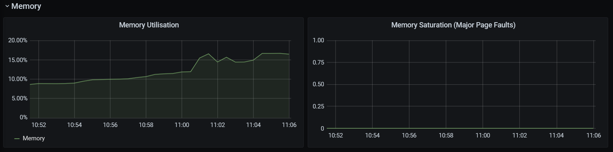

### Conditions

* 1 `vegeta` sender running on a dedicated compute-optimized node (GCE [c2-standard-8][gce-machines])
* 1 [`thrpt-receiver`][thrpt-receiver] instances running on dedicated `user-loads` nodes (GCE
  [n1-standard-2][gce-machines])

The load test was performed using the [ramp-requests.py](../../load-ramping/) script, which runs a succession of attacks
at different rates in periods of 5s, ranging from 1 event/sec to 79,432 events/sec (theoretical), with a payload of 2
KiB.

### Results

The throughput and latency metrics are reported in the _Profiling_ section of [`thrpt-receiver`][thrpt-receiver]'s
README file.

The following graphs show some additional node and Pod-level metrics of the sender and receiver.

#### Sender

#### Receiver

We can observe some network saturation on the receiver's end during the higher attack rates:

While this problem needs some further investigation to be fully understood, the following blog article provides
extensive details about troubleshooting low-level network issues on Linux: [Debugging network stalls on
Kubernetes][gh-blog-k8snet].

[gce-machines]: https://cloud.google.com/compute/docs/machine-types
[thrpt-receiver]: ../../thrpt-receiver/
[gh-blog-k8snet]: https://github.blog/2019-11-21-debugging-network-stalls-on-kubernetes/
