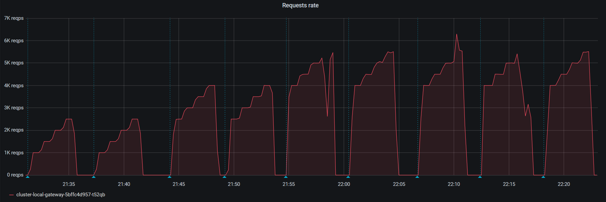
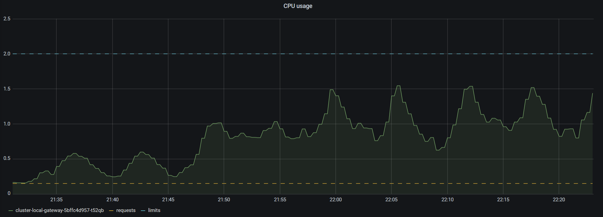
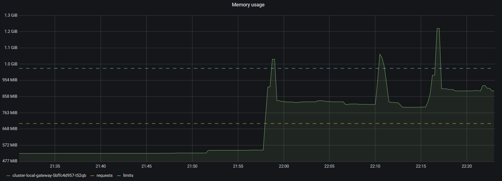
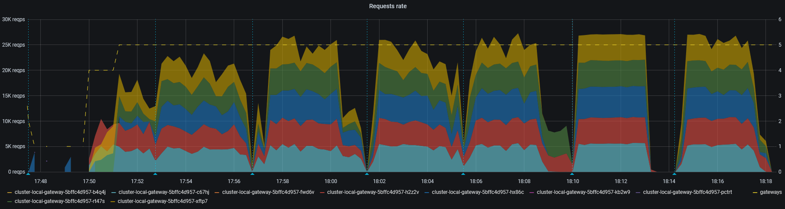
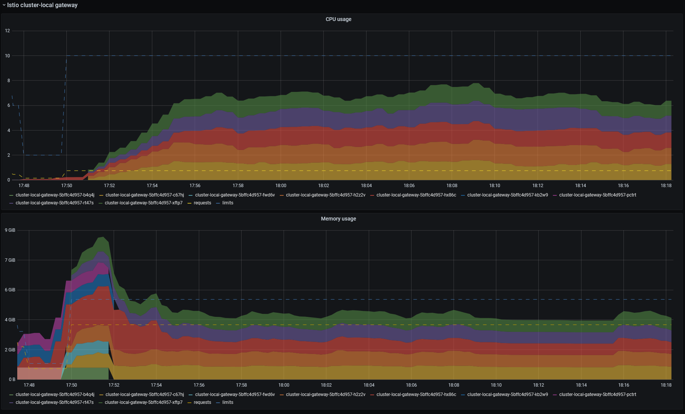
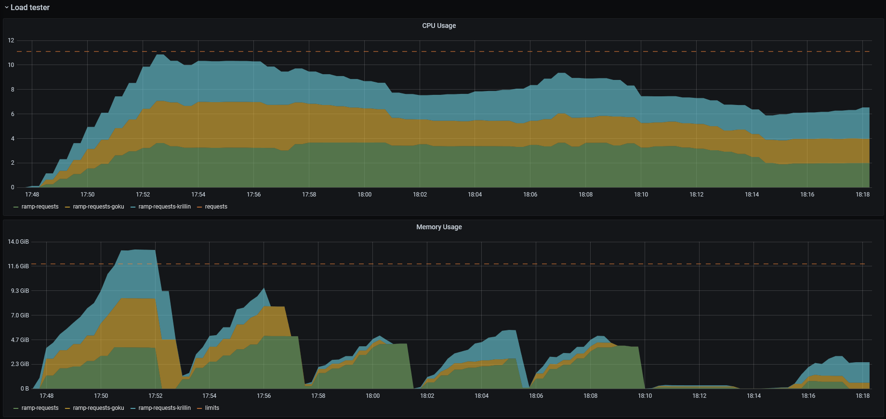
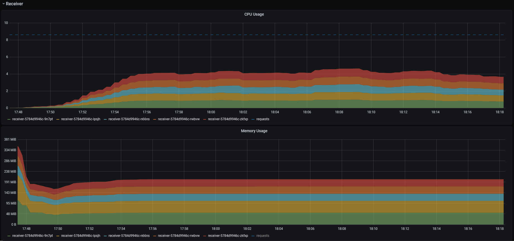

### Conditions

* Istio `cluster-local` gateway configured as per [base/istio @ee2f2bf7][config-istio]
  * Production values for resources requests/limits as per [overlays/prod/istio @ee2f2bf7][config-istio-res]
  * Horizontal Pod autocaler capped at 5 replicas (Istio operator's default)
* 3 concurrent `vegeta` senders running on dedicated `control-plane` nodes (GCE [n1-standard-4][gce-machines])
* 5 [`receiver`][receiver] instances running on dedicated `user-loads` nodes (GCE [n1-standard-2][gce-machines])
  * _This number is purposely high to prevent the receiving end from being a bottleneck._

All payloads are CloudEvents generated by [`cegen`][cegen] with a fixed data of 2 KiB, and piped to `vegeta`:

```console
$ cegen -u http://receiver.default.svc.cluster.local -d @/sample-ce-data.json \
  | vegeta attack -lazy -format=json -duration=3m -rate=9000/s \
  | vegeta report
```

### Results

_In the following analysis, we consider a test successful if its p99 is below 1s and its success rate is 100%._

An initial load test with a single `cluster-local` gateway instance (HPA disabled) allowed us to establish a maximum
throughput per instance of about **5,000 req/s**. Above this value, we tend to see failures and some latency values way
higher than our target.





After allowing the gateway to scale by re-enabling the HPA, we ran a series of attacks coordinated between the 3
attackers.

The initial value of 28,500 req/s (3x 9,500) was too aggressive for a "cold" start. The single gateway instance had to
cope with all the traffic while the 4 other instances were scaling, and ran out of memory multiple times in the process
(OOM Killed). This resulted in a large number of `read: connection reset by peer` errors.

After all gateways were up and running, we pushed the requests rate a few more times to 28,500 req/s by periods of 3m.
Although the resources usage seemed stable on the gateways, we consistently observed a significant number of errors as
well as latencies >1m on one one of the attackers:

```
Requests      [total, rate, throughput]         1710003, 9498.49, 9475.55
Duration      [total, attack, wait]             3m0s, 3m0s, 435.807ms
Latencies     [min, mean, 50, 90, 95, 99, max]  666.428µs, 333.421ms, 273.558ms, 736.341ms, 831.432ms, 1.016s, 1.622s
Bytes In      [total, mean]                     0, 0.00
Bytes Out     [total, mean]                     3502086144, 2048.00
Success       [ratio]                           100.00%
Status Codes  [code:count]                      200:1710003
Error Set:

Requests      [total, rate, throughput]         1710003, 9500.02, 9499.23
Duration      [total, attack, wait]             3m0s, 3m0s, 14.93ms
Latencies     [min, mean, 50, 90, 95, 99, max]  654.38µs, 332.302ms, 273.589ms, 733.613ms, 829.325ms, 1.003s, 1.491s
Bytes In      [total, mean]                     0, 0.00
Bytes Out     [total, mean]                     3502086144, 2048.00
Success       [ratio]                           100.00%
Status Codes  [code:count]                      200:1710003
Error Set:

Requests      [total, rate, throughput]         1701618, 9437.76, 7294.89
Duration      [total, attack, wait]             3m53s, 3m0s, 52.371s
Latencies     [min, mean, 50, 90, 95, 99, max]  768.549µs, 42.725s, 54.612s, 1m10s, 1m12s, 1m14s, 2m46s
Bytes In      [total, mean]                     0, 0.00
Bytes Out     [total, mean]                     3476072448, 2042.80
Success       [ratio]                           99.75%
Status Codes  [code:count]                      0:4317  200:1697301
Error Set:
Post "http://receiver.default.svc.cluster.local": dial tcp 0.0.0.0:0->10.19.255.236:80: bind: address already in use
Post "http://receiver.default.svc.cluster.local": read tcp 10.16.42.5:34041->10.19.255.236:80: read: connection reset by peer
Post "http://receiver.default.svc.cluster.local": read tcp 10.16.42.5:53651->10.19.255.236:80: read: connection reset by peer
Post "http://receiver.default.svc.cluster.local": read tcp 10.16.42.5:51885->10.19.255.236:80: read: connection reset by peer
...
```

At **27,000 req/s** (3x 9,000) we observed stable latencies and no error:

```
Requests      [total, rate, throughput]         1620002, 8999.95, 8999.11
Duration      [total, attack, wait]             3m0s, 3m0s, 16.983ms
Latencies     [min, mean, 50, 90, 95, 99, max]  683.892µs, 66.64ms, 56.881ms, 148.832ms, 175.841ms, 225.99ms, 418.722ms
Bytes In      [total, mean]                     0, 0.00
Bytes Out     [total, mean]                     3317764096, 2048.00
Success       [ratio]                           100.00%
Status Codes  [code:count]                      200:1620002
Error Set:

Requests      [total, rate, throughput]         1620002, 9000.01, 8997.52
Duration      [total, attack, wait]             3m0s, 3m0s, 49.78ms
Latencies     [min, mean, 50, 90, 95, 99, max]  688.251µs, 67.238ms, 57.038ms, 152.864ms, 179.835ms, 226.468ms, 425.297ms
Bytes In      [total, mean]                     0, 0.00
Bytes Out     [total, mean]                     3317764096, 2048.00
Success       [ratio]                           100.00%
Status Codes  [code:count]                      200:1620002
Error Set:

Requests      [total, rate, throughput]         1620002, 9000.00, 8993.51
Duration      [total, attack, wait]             3m0s, 3m0s, 130.002ms
Latencies     [min, mean, 50, 90, 95, 99, max]  630.188µs, 63.145ms, 51.096ms, 145.972ms, 171.969ms, 219.711ms, 428.449ms
Bytes In      [total, mean]                     0, 0.00
Bytes Out     [total, mean]                     3317764096, 2048.00
Success       [ratio]                           100.00%
Status Codes  [code:count]                      200:1620002
Error Set:
```



The memory and CPU usage of the gateways remained within their respective limits:






[gce-machines]: https://cloud.google.com/compute/docs/machine-types
[config-istio]: https://github.com/triggermesh/config/blob/ee2f2bf78964417b2912add886f265862b1de421/base/istio/istio.yaml
[config-istio-res]: https://github.com/triggermesh/config/blob/ee2f2bf78964417b2912add886f265862b1de421/overlays/prod/istio/gateways-k8s-resources.yaml
[receiver]: ../../receiver/
[cegen]: ../../tools/cegen/
