### Conditions

* 1 `vegeta` sender running on a dedicated compute-optimized node (GCE [c2-standard-8][gce-machines])
* [`receiver`][receiver] deployed as a Knative Service running on dedicated `user-loads` nodes (GCE
  [n1-standard-2][gce-machines]). See [Results](#results) for specific configurations.

All payloads are CloudEvents generated by [`cegen`][cegen] with a fixed data of 2 KiB, and piped to `vegeta` at various
rates:

```console
$ cegen -u http://receiver.default.svc.cluster.local -d @/sample-ce-data.json \
  | vegeta attack -lazy -format=json -duration=3m -rate=10000/s \
  | vegeta report
```


### Results

_The size of the `user-loads` node pool was set to a fixed size of `20` in order to avoid externally-introduced delays
while (auto-)scaling the receivers._

The following resources requests and limits were set on `receiver` containers, based on our observations while
performing previous load tests.

```yaml
resources:
  requests:
    cpu: 150m
    memory: 50Mi
  limits:
    cpu: 500m
    memory: 350Mi
```

#### Scenario 1: `targetBurstCapacity=0`

In this load test, the requests rate was ramped from 1,000 requests/sec up to 4,000 requests/sec by increments of 200
requests/sec in periods of 3 min. A initial attack at 10,000 requests/sec was performed in order to scale and warm up
Istio gateways (before the vertical dashed marker).

We initially observed large fluctuations in the number of scheduled replicas ("roller coasters") while using default
auto-scaling settings, which we tried to mitigate by setting the revision's [target burst capacity][kn-burstcap] to `0`
(moves the activator out of the routing path), as suggested by Knative developers after showing them our graphs in the
`#autoscaling` Slack channel. Our receiver is capable of handling highly concurrent traffic, so placing the activator in
the routing path shouldn't provide any benefit anyway.

This unfortunately didn't prevent fluctuations, and we observed a sudden increase of errors and latencies from 1,800
requests/sec onwards due to constant scale-in and scale-out:

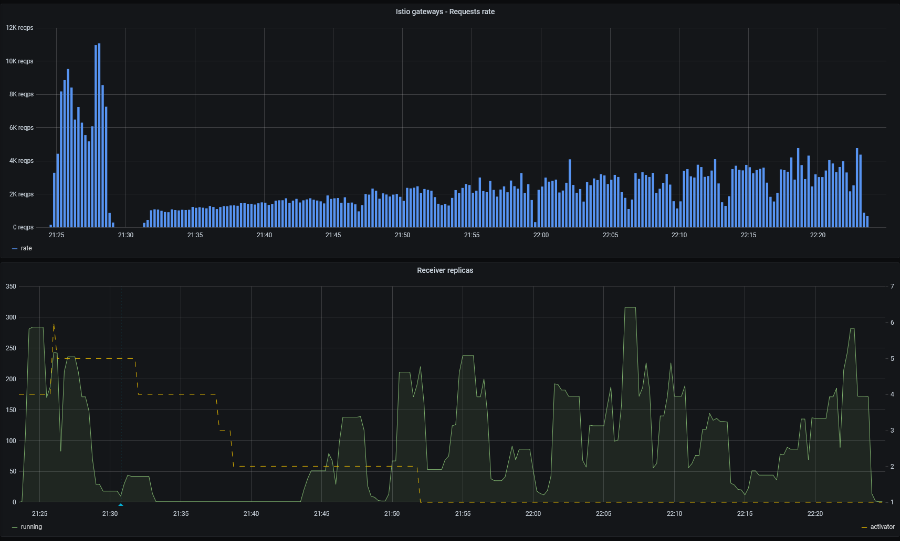

1,600 requests/sec, successful with satisfying latencies:

```
Requests      [total, rate, throughput]         288000, 1600.01, 1599.99
Duration      [total, attack, wait]             3m0s, 3m0s, 1.25ms
Latencies     [min, mean, 50, 90, 95, 99, max]  937.393µs, 4.1ms, 1.46ms, 8.835ms, 15.541ms, 40.904ms, 289.441ms
Bytes In      [total, mean]                     0, 0.00
Bytes Out     [total, mean]                     589824000, 2048.00
Success       [ratio]                           100.00%
Status Codes  [code:count]                      200:288000
Error Set:
```

1,800 requests/sec, large number of errors and high latencies:

```
Requests      [total, rate, throughput]         324001, 1800.01, 1446.74
Duration      [total, attack, wait]             3m25s, 3m0s, 25.05s
Latencies     [min, mean, 50, 90, 95, 99, max]  442.325µs, 1.211s, 1.834ms, 1.26s, 8.062s, 30s, 30.003s
Bytes In      [total, mean]                     1698867, 5.24
Bytes Out     [total, mean]                     649109504, 2003.42
Success       [ratio]                           91.56%
Status Codes  [code:count]                      0:7053  200:296654  502:87  503:20207
Error Set:
Post "http://receiver.perf-receiver.svc.cluster.local": read tcp 10.16.63.2:55193->10.19.255.236:80: read: connection reset by peer
503 Service Unavailable
Post "http://receiver.perf-receiver.svc.cluster.local": context deadline exceeded (Client.Timeout exceeded while awaiting headers)
502 Bad Gateway
```

Despite the high number of replicas, only a handful of receivers seem to be busy at all times:

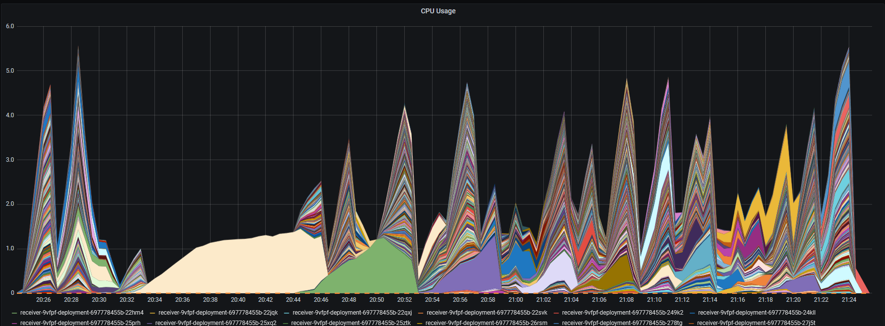
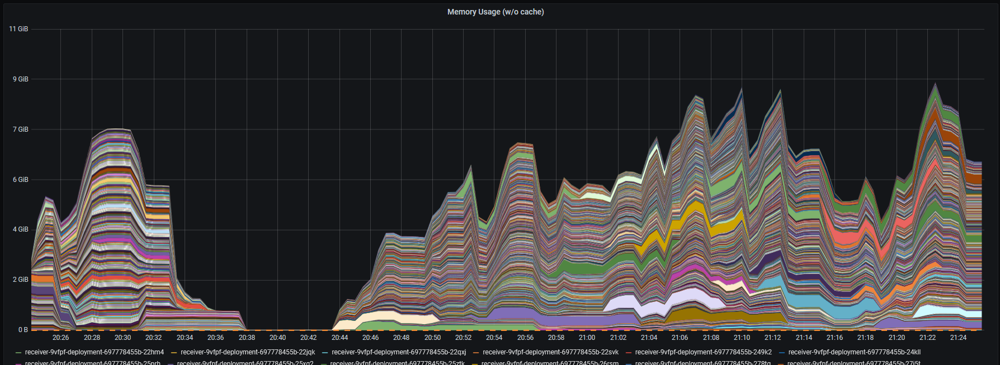

The `queue-proxy` container consumes about twice as much CPU time as the `receiver` container under load:

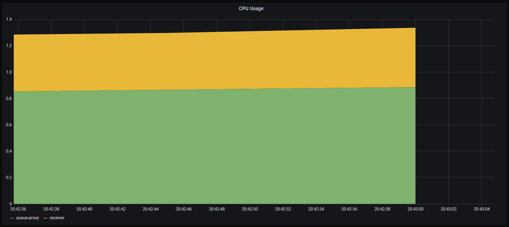

Cluster nodes were not showing signs of saturation:

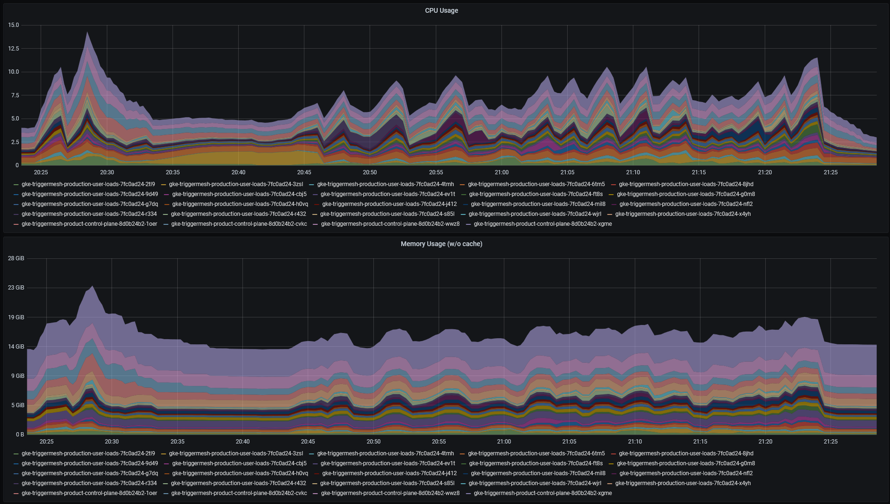

#### Scenario 2: `maxScale=5`

In this load test, the requests rate was ramped from 1,000 requests/sec up to 4,000 requests/sec by increments of 200
requests/sec in periods of 90 seconds. A initial attack at 10,000 requests/sec was performed in order to scale and warm
up Istio gateways (before the vertical dashed marker).

This time, we keep the revision's [target burst capacity][kn-burstcap] default value untouched, but cap the Service's
scale at `5` replicas to prevent the uncontrollable scaling we saw in Scenario 1.

Even with this configuration, the number of receiver replicas doesn't remain stable, and a regular rotation of existing
receivers causes the graph to occasionally display more than `5` running receiver Pods. The number of activators
increases linearly as we would expect:

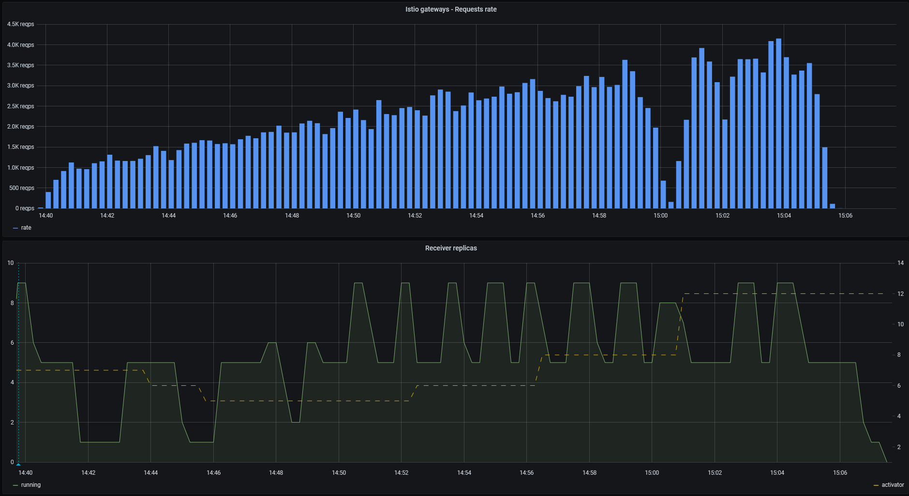

In this run, no error occurred below 2,800 requests/sec, but errors occurred consistently above that rate. Besides, the
p90/p99 latencies were high every time the receiver was scaled:

```
# ok
Requests      [total, rate, throughput]         108000, 1200.01, 1199.99
Duration      [total, attack, wait]             1m30s, 1m30s, 1.696ms
Latencies     [min, mean, 50, 90, 95, 99, max]  1.35ms, 2.488ms, 1.903ms, 3.371ms, 5.401ms, 13.699ms, 56.421ms
Bytes In      [total, mean]                     0, 0.00
Bytes Out     [total, mean]                     221184000, 2048.00
Success       [ratio]                           100.00%
Status Codes  [code:count]                      200:108000  
Error Set:

# much higher p90, very high p99
Requests      [total, rate, throughput]         126001, 1400.01, 1399.98
Duration      [total, attack, wait]             1m30s, 1m30s, 1.414ms
Latencies     [min, mean, 50, 90, 95, 99, max]  971.841µs, 42.422ms, 1.593ms, 4.042ms, 74.099ms, 1.176s, 2.18s
Bytes In      [total, mean]                     19, 0.00
Bytes Out     [total, mean]                     258050048, 2048.00
Success       [ratio]                           100.00%
Status Codes  [code:count]                      200:126001
Error Set:

# ok
Requests      [total, rate, throughput]         144000, 1600.02, 1599.98
Duration      [total, attack, wait]             1m30s, 1m30s, 1.598ms
Latencies     [min, mean, 50, 90, 95, 99, max]  999.94µs, 4.723ms, 1.969ms, 10.863ms, 17.25ms, 40.159ms, 148.309ms
Bytes In      [total, mean]                     19, 0.00
Bytes Out     [total, mean]                     294912000, 2048.00
Success       [ratio]                           100.00%
Status Codes  [code:count]                      200:144000
Error Set:

...

# some errors, high p90+
Requests      [total, rate, throughput]         252001, 2800.02, 2799.92
Duration      [total, attack, wait]             1m30s, 1m30s, 1.737ms
Latencies     [min, mean, 50, 90, 95, 99, max]  939.276µs, 39.277ms, 1.573ms, 64.541ms, 198.9ms, 947.871ms, 2.038s
Bytes In      [total, mean]                     76, 0.00
Bytes Out     [total, mean]                     516098048, 2048.00
Success       [ratio]                           100.00%
Status Codes  [code:count]                      200:251997  503:4  
Error Set:
503 Service Unavailable
```

The load is more or less evenly distributed between activators:

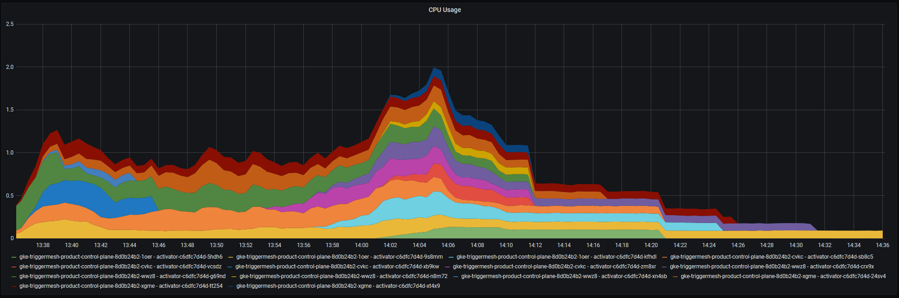
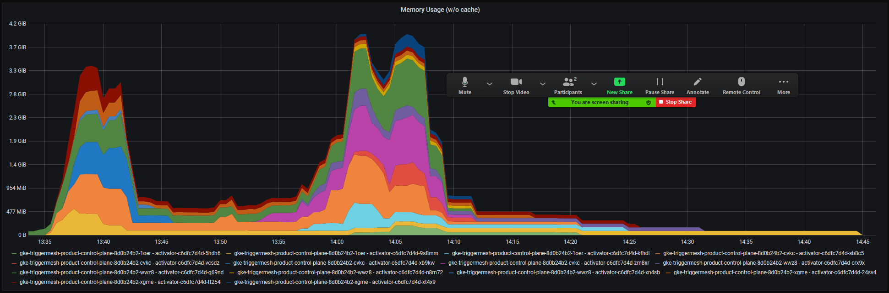

This time again, only a subset of receivers seem to be busy at all times:

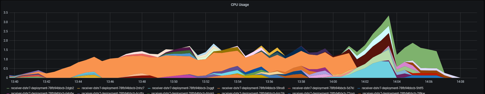
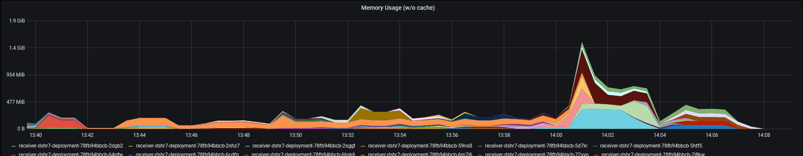

The `queue-proxy` container still consumes more than twice as much CPU time as the `receiver` container under load:

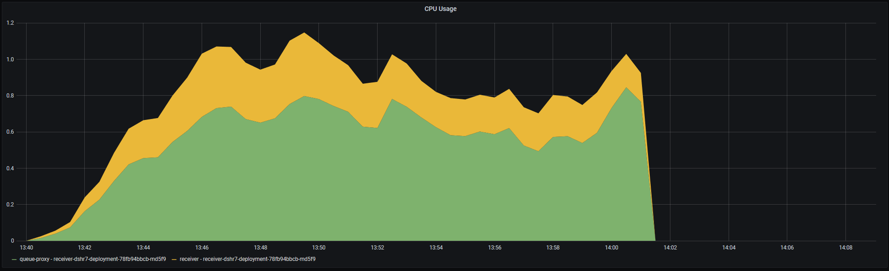

[gce-machines]: https://cloud.google.com/compute/docs/machine-types
[receiver]: ../../receiver/
[cegen]: ../../tools/cegen/
[kn-burstcap]: https://knative.dev/docs/serving/autoscaling/target-burst-capacity/
[kn-bounds]: https://knative.dev/docs/serving/autoscaling/scale-bounds/
