### Conditions

| Component        | Version            |
| ---------------- | ------------------ |
| Kubernetes       | `v1.17.12-gke.500` |
| Istio            | `v1.7.3`           |

* 10 `vegeta` senders running on dedicated nodes (GCE [n1-standard-4][gce-machines])
* 20 Istio `ingressgateway` Pods running on dedicated nodes (GCE [n1-standard-4][gce-machines])
  * Pre-scaled, horizontal Pod autoscaling temporarily disabled
  * Production values for resources requests/limits as per [overlays/prod/istio @df7e1a80][config-istio-res]
  * Default resource limits of `2` (CPU) and `1Gi` (memory) are implicitly applied
* 20 [`receiver`][receiver] instances running on dedicated `user-loads` nodes (GCE [n1-standard-2][gce-machines])
  * Pre-scaled, cluster autoscaling temporarily disabled
  * Exposed behind an Istio `VirtualService`
  * _This number is purposely high to prevent the receiving end from being a bottleneck._

Those predictions in terms of infrastructure requirements are based on previous load tests, based on the assumption
that:

* A single `vegeta` attacker can produce up to **14,000 requests/sec** on this type of machine
* A single Istio ingress gateway instance can serve up to **5,000 requests/sec**
* A single `receiver` can accept up to **12,000 events/sec** (based on profiling data from the
  [thrpt-receiver][thrpt-receiver])

All payloads are CloudEvents generated by [`cegen`][cegen] with a fixed data of 2 KiB, and piped to `vegeta` at the
desired rate:

```console
$ cegen -u http://receiver.default.svc.cluster.local -d @/sample-ce-data.json \
  | vegeta attack -lazy -format=json -duration=10m -rate=10000/s \
  | vegeta report
```

### Results

#### 100k events/sec

All attackers were started simultaneously for a duration of 10 min.

At the end of the attack, all `vegeta` instances reported very consistent numbers similar to the ones from the sample
below:

```
Requests      [total, rate, throughput]         6000000, 10000.00, 9999.97
Duration      [total, attack, wait]             10m0s, 10m0s, 1.961ms
Latencies     [min, mean, 50, 90, 95, 99, max]  547.667µs, 3.59ms, 1.768ms, 5.733ms, 8.84ms, 45.743ms, 171.562ms
Bytes In      [total, mean]                     0, 0.00
Bytes Out     [total, mean]                     12288000000, 2048.00
Success       [ratio]                           100.00%
Status Codes  [code:count]                      200:6000000
Error Set:
```

Only 1 attacker out of 10 reported a slightly higher latency at the 99th percentile:

```
Requests      [total, rate, throughput]         6000000, 10000.00, 9999.98
Duration      [total, attack, wait]             10m0s, 10m0s, 1.665ms
Latencies     [min, mean, 50, 90, 95, 99, max]  558.338µs, 3.404ms, 1.659ms, 5.393ms, 8.403ms, 45.133ms, 659.026ms
Bytes In      [total, mean]                     0, 0.00
Bytes Out     [total, mean]                     12288000000, 2048.00
Success       [ratio]                           100.00%
Status Codes  [code:count]                      200:6000000
Error Set:
```

Profile of the Istio ingress gateway instances during the load test:

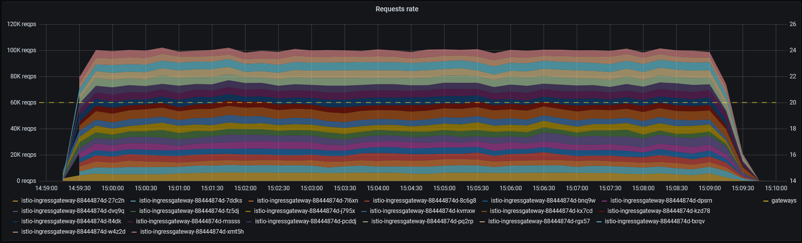
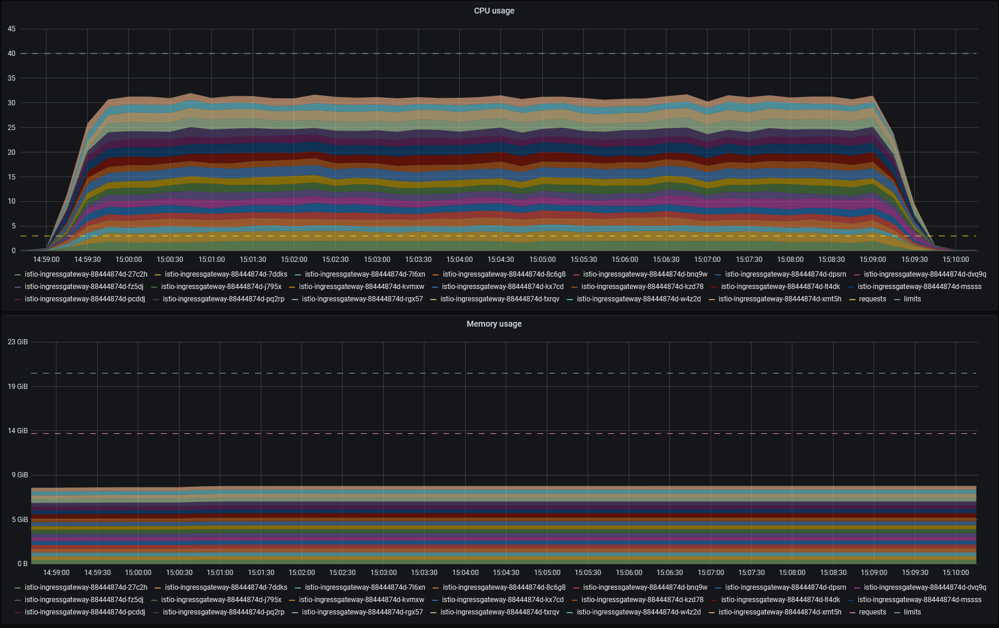

CPU throttling did occur, but not uniformly across all ingress gateway Pods, and didn't prevent the performance target
from being reached:

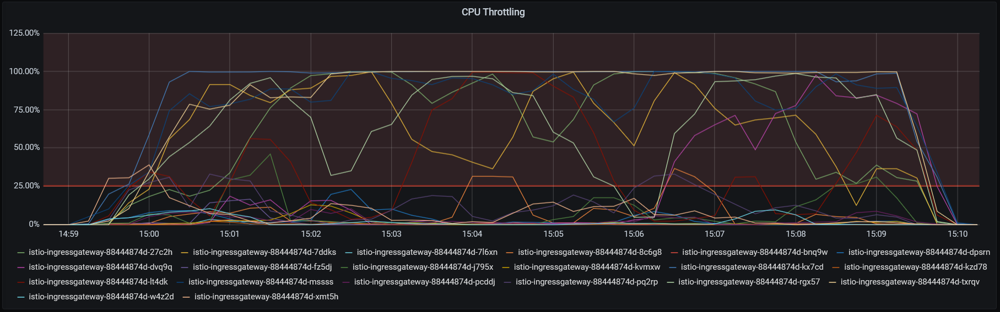

> :information_source: *A note about CPU throttling: a value of 100% means that **some** throttling occurs in **every**
> observed CFS period of 100ms, not that every CFS period is throttled at 100%.*

Below is a profile of the event receivers. No packet drop was observed during the load test.

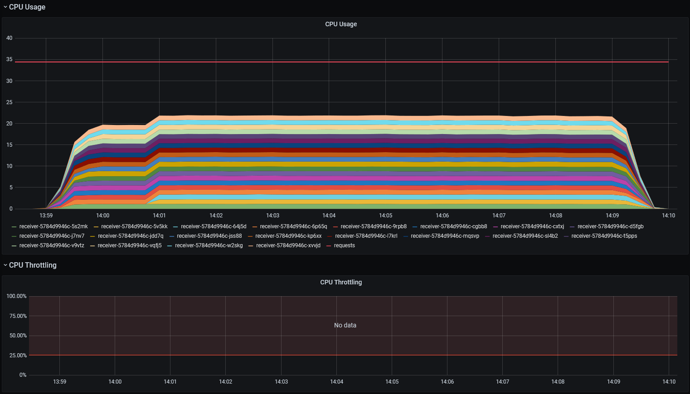
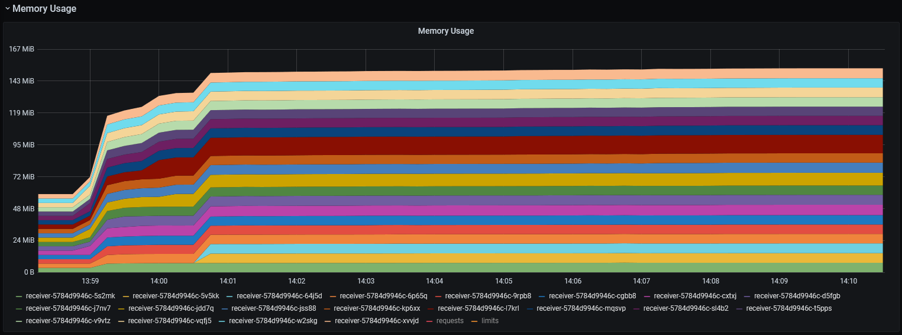
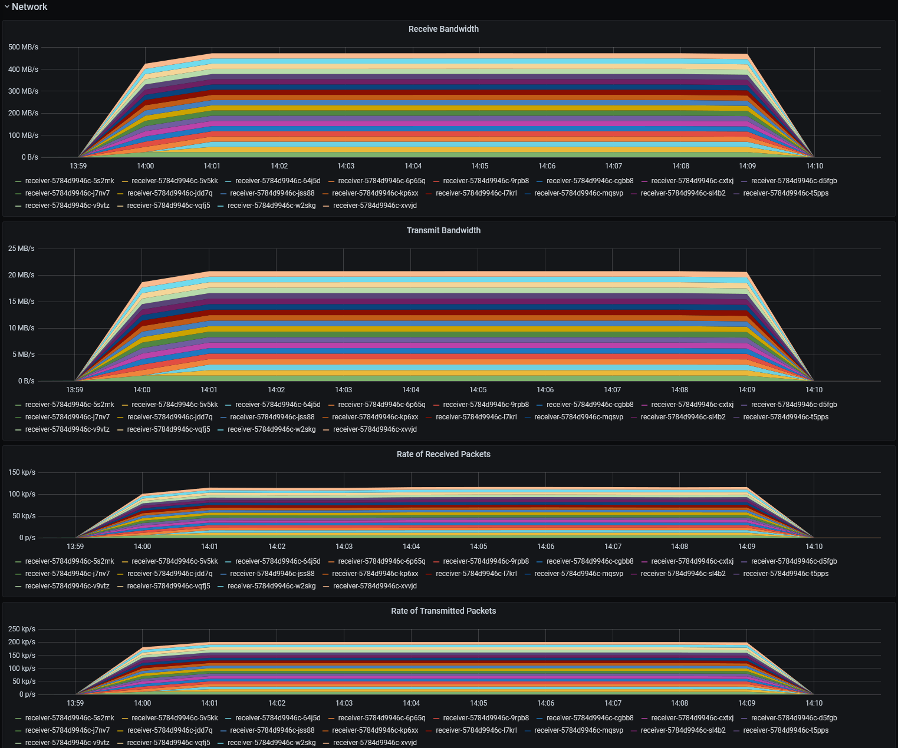

#### 120k events/sec

In a second load test, we pushed the request rate a little bit higher at 120,000 requests/sec to see how the platform
would react.

Although the success rate remained 100%, we observed significantly higher and more heterogeneous latencies this time, as
shown in the sample below:

```
Requests      [total, rate, throughput]         7200029, 11999.98, 11998.78
Duration      [total, attack, wait]             10m0s, 10m0s, 60.217ms
Latencies     [min, mean, 50, 90, 95, 99, max]  581.282µs, 61.617ms, 6.858ms, 208.996ms, 333.87ms, 726.76ms, 2.742s
Bytes In      [total, mean]                     0, 0.00
Bytes Out     [total, mean]                     14745659392, 2048.00
Success       [ratio]                           100.00%
Status Codes  [code:count]                      200:7200029
Error Set:
```

The 95th and 99th percentile varied between **534.538ms** and **47.568s**, and between **2.115s** and **2m4s**
respectively. The 2 worse samples are shown below:

```
Requests      [total, rate, throughput]         7200029, 11999.71, 11984.90
Duration      [total, attack, wait]             10m1s, 10m0s, 741.357ms
Latencies     [min, mean, 50, 90, 95, 99, max]  539.719µs, 980.924ms, 6.953ms, 5.397s, 7.29s, 8.812s, 25.525s
Bytes In      [total, mean]                     0, 0.00
Bytes Out     [total, mean]                     14745659392, 2048.00
Success       [ratio]                           100.00%
Status Codes  [code:count]                      200:7200029
Error Set:
```

```
Requests      [total, rate, throughput]         7192565, 11986.82, 11216.92
Duration      [total, attack, wait]             10m41s, 10m0s, 41.185s
Latencies     [min, mean, 50, 90, 95, 99, max]  568.769µs, 8.182s, 44.014ms, 39.748s, 45.03s, 47.568s, 2m4s
Bytes In      [total, mean]                     0, 0.00
Bytes Out     [total, mean]                     14730373120, 2048.00
Success       [ratio]                           100.00%
Status Codes  [code:count]                      200:7192565
Error Set:
```

Profile of the Istio ingress gateway instances during the load test:

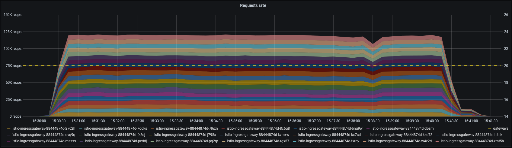
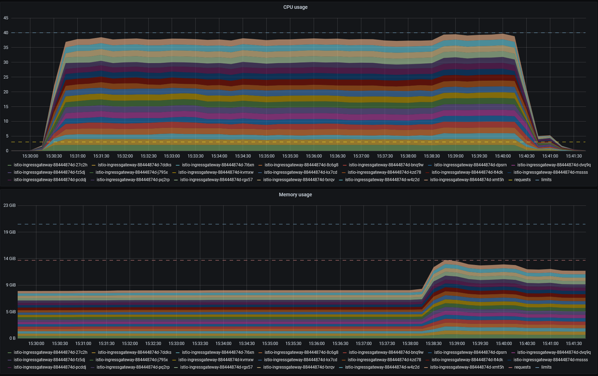

CPU throttling occurred more uniformly this time. Towards the end of the attack, all Pods were throttled at nearly 100%,
which explains the slight drop in request rate:

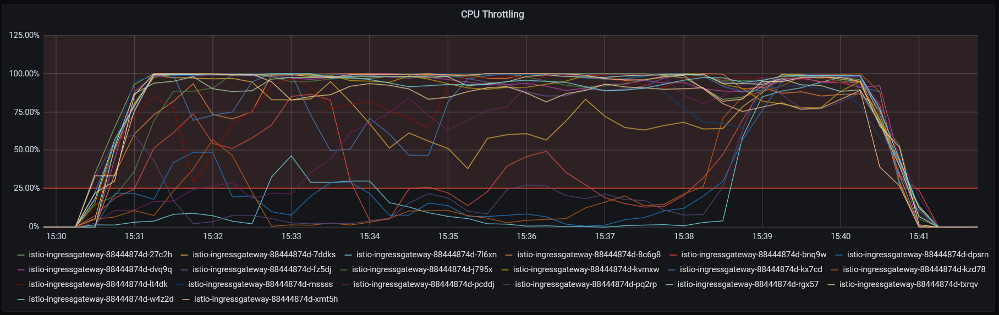

Below is a profile of the event receivers. No packet drop was observed during the load test.

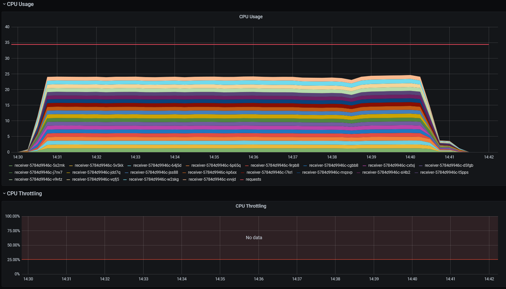

A spike in memory usage was observed at the same moment as Istio's CPU usage got uniformly throttled, because the
receiver had to keep connections open for a longer time when this occurred. The reason why the memory didn't get
released after the fact is irrelevant in the context of this load test. It is being discussed at
[cloudevents/sdk-go#635][ce-sdk-issue635].

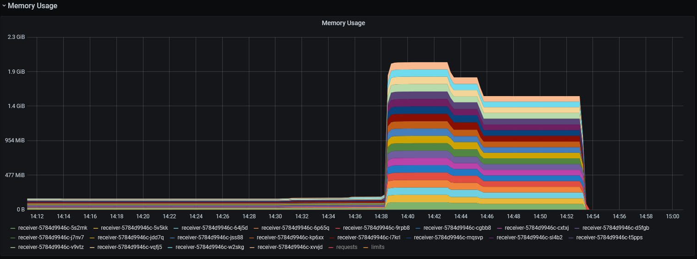
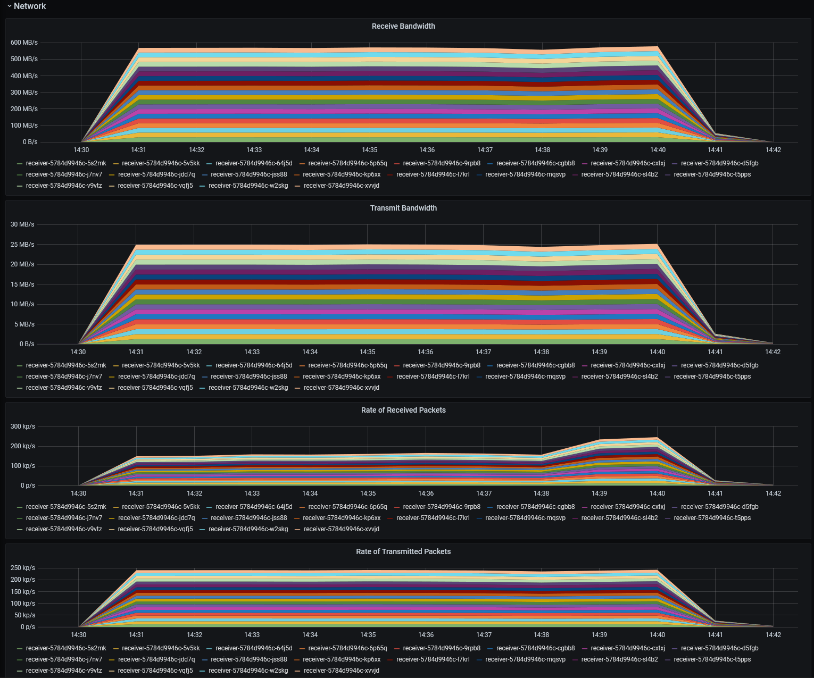

[gce-machines]: https://cloud.google.com/compute/docs/machine-types
[receiver]: ../../receiver/
[thrpt-receiver]: ../../thrpt-receiver#throughput
[cegen]: ../../tools/cegen/
[config-istio-res]: https://github.com/triggermesh/config/blob/df7e1a80db4cdbd32f9356b6e838b2453c79bdd8/overlays/prod/istio/gateways-k8s-resources.yaml
[ce-sdk-issue635]: https://github.com/cloudevents/sdk-go/issues/635
