### Conditions

| Component        | Version            |
| ---------------- | ------------------ |
| Kubernetes       | `v1.17.12-gke.500` |
| Knative Eventing | `v0.19.2`          |

Depending on the test:

* 1-3 `vegeta` senders running on dedicated nodes (GCE [n1-standard-4][gce-machines])
* 1-5 `imc-dispatcher` Pods running on dedicated nodes (GCE [n1-standard-4][gce-machines])
* Broker ingress and filter running using Knative's default configuration
  * Pre-scaled, horizontal Pod autocaler locked at 10 replicas (Knative's default maximum)
* 1 [`thrpt-receiver`][thrpt-receiver] instance or 5 [`receiver`][receiver] instances running on dedicated `user-loads`
  node (GCE [n1-standard-2][gce-machines])

Assumptions based on previous load tests:

* A single `vegeta` attacker can produce up to **14,000 requests/sec** on this type of machine
* A single `receiver`/`thrpt-receiver` can accept up to **12,000 events/sec** (based on [profiling
  data][thrpt-receiver-profile])

---

## Results

1. [Isolated channel](#isolated-channel)
   * [Single instance](#single-instance)
     * [Bursts](#bursts)
     * [Sustained](#sustained)
   * [Multiple instances](#multiple-instances)
1. [Broker with channel](#broker-with-channel)
   * [Throughput](#throughput)
   * [End-to-end latency](#end-to-end-latency)
     * [Single dispatcher](#single-dispatcher)
     * [Multiple dispatchers](#multiple-dispatchers)

## Isolated channel

The channel was first tested in isolation from the broker by sending events directly to the channel URL instead of the
broker's ingress URL. A Subscription object was used to deliver events to the receiver without transiting over the
broker's filter.

_tl;dr;_ Short bursts (< 5s) of up to **5,000 events/sec** are ingested without difficulty, but the dispatcher can only
sustain a constant load of up to **2,000 events/sec**. With 5 replicas of the channel dispatcher, this limit increases
to **3,000 events/sec** per dispatcher.

```yaml
# Subscribe to events from "default" broker's channel, deliver them to receiver/thrpt-receiver.
apiVersion: messaging.knative.dev/v1
kind: Subscription
metadata:
  name: perf
  namespace: antoineco
spec:
  channel:
    apiVersion: messaging.knative.dev/v1
    kind: InMemoryChannel
    name: default-kne-trigger
  subscriber:
    uri: http://receiver-internal.perf-receiver.svc.cluster.local/
```

### Single instance

We first assessed the performance of a single instance of the IMC dispatcher.

#### Bursts

This particular load test was performed using the [ramp-requests.py](../../load-ramping/) script, which runs a
succession of attacks at different rates in periods of 5s, ranging from 1 event/sec to 79,432 events/sec (theoretical),
with a payload of 2 KiB.

The latency and error distribution is shown in the graph below.

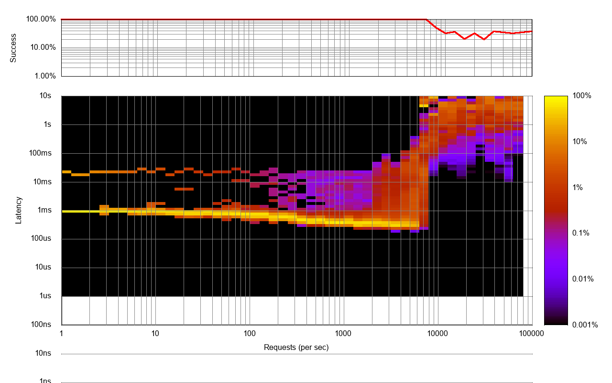

Vegeta reports confirm that latencies increase drastically above **5,000 events/sec**, errors start occuring above that
rate as well.

```
Requests      [total, rate, throughput]         15812, 3162.55, 3155.40
Duration      [total, attack, wait]             5.011s, 5s, 11.33ms
Latencies     [min, mean, 50, 90, 95, 99, max]  193.639µs, 840.305µs, 310.898µs, 570.704µs, 1.792ms, 18.047ms, 47.724ms
Bytes In      [total, mean]                     0, 0.00
Bytes Out     [total, mean]                     32382976, 2048.00
Success       [ratio]                           100.00%
Status Codes  [code:count]                      202:15812  
Error Set:
```

```
Requests      [total, rate, throughput]         19906, 3981.29, 3981.06
Duration      [total, attack, wait]             5s, 5s, 287.854µs
Latencies     [min, mean, 50, 90, 95, 99, max]  208.219µs, 3.823ms, 341.881µs, 8.306ms, 27.991ms, 52.676ms, 122.688ms
Bytes In      [total, mean]                     0, 0.00
Bytes Out     [total, mean]                     40767488, 2048.00
Success       [ratio]                           100.00%
Status Codes  [code:count]                      202:19906  
Error Set:
```

```
Requests      [total, rate, throughput]         25060, 5012.07, 5011.76
Duration      [total, attack, wait]             5s, 5s, 315.654µs
Latencies     [min, mean, 50, 90, 95, 99, max]  197.712µs, 11.041ms, 442.736µs, 38.813ms, 73.809ms, 127.504ms, 319.378ms
Bytes In      [total, mean]                     0, 0.00
Bytes Out     [total, mean]                     51322880, 2048.00
Success       [ratio]                           100.00%
Status Codes  [code:count]                      202:25060  
Error Set:
```

```
Requests      [total, rate, throughput]         31535, 6307.39, 969.75
Duration      [total, attack, wait]             32.452s, 5s, 27.452s
Latencies     [min, mean, 50, 90, 95, 99, max]  215.036µs, 2.908s, 4.28s, 5.021s, 7.363s, 8.015s, 30s
Bytes In      [total, mean]                     0, 0.00
Bytes Out     [total, mean]                     64450560, 2043.78
Success       [ratio]                           99.79%
Status Codes  [code:count]                      0:65  202:31470  
Error Set:
Post "http://default-kne-trigger-kn-channel.antoineco.svc.cluster.local": context deadline exceeded (Client.Timeout exceeded while awaiting headers)
```

```
Requests      [total, rate, throughput]         39687, 7737.81, 627.01
Duration      [total, attack, wait]             32.664s, 5.129s, 27.535s
Latencies     [min, mean, 50, 90, 95, 99, max]  17.473ms, 5.845s, 8.215s, 9.909s, 10.007s, 11.221s, 30s
Bytes In      [total, mean]                     0, 0.00
Bytes Out     [total, mean]                     41945088, 1056.90
Success       [ratio]                           51.61%
Status Codes  [code:count]                      0:19206  202:20481  
Error Set:
Post "http://default-kne-trigger-kn-channel.antoineco.svc.cluster.local": dial tcp 0.0.0.0:0->10.19.253.198:80: bind: address already in use
Post "http://default-kne-trigger-kn-channel.antoineco.svc.cluster.local": read tcp 10.16.172.4:33958->10.19.253.198:80: read: connection reset by peer
...
Post "http://default-kne-trigger-kn-channel.antoineco.svc.cluster.local": context deadline exceeded (Client.Timeout exceeded while awaiting headers)
```

From looking at the metrics reported by `thrpt-receiver` and the dispatcher itself, it is clear that we have gaps in
deliveries above the 5,000 events/sec mark.

_Note: The dashboard below doesn't show accurate instant rates due to Prometheus' long scraping intervals._

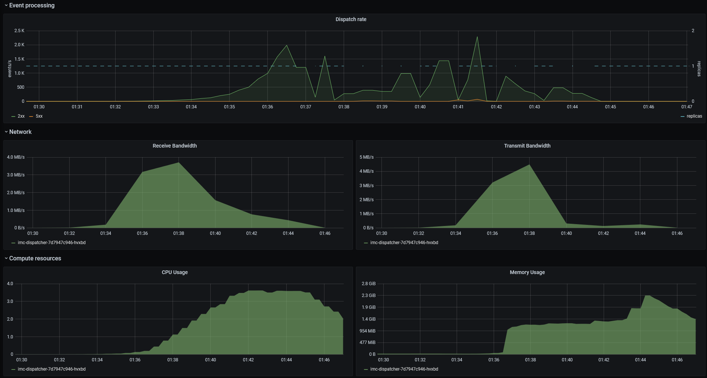

The gaps in deliveries are also visible from the receiver's perspective.

_Note: Timestamps in the receiver's metrics do not match the ones from the dispatcher's because they were both extracted
from different load tests with comparable results._

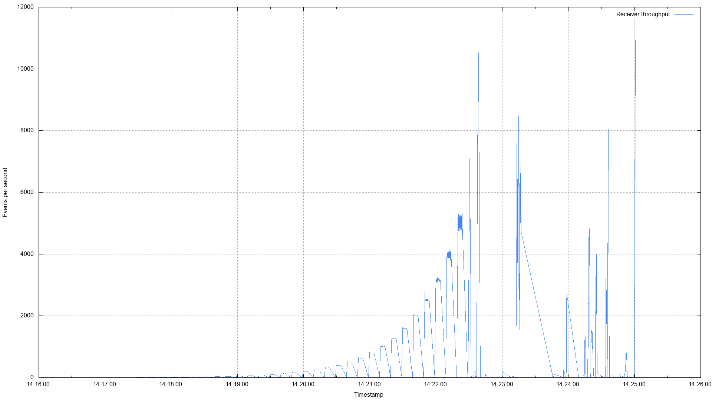
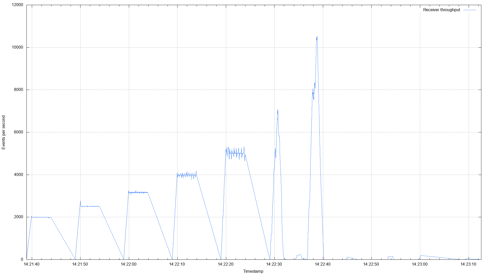

```
2020/12/08 14:13:36 Waiting for the first event to be received
2020/12/08 14:16:08 Event received, waiting until no more event is being recorded for 6 consecutive periods of 5s
2020/12/08 14:16:28 Observed 1 period(s) without event
2020/12/08 14:16:38 Observed 1 period(s) without event
2020/12/08 14:16:48 Observed 1 period(s) without event
2020/12/08 14:16:58 Observed 1 period(s) without event
2020/12/08 14:17:08 Observed 1 period(s) without event
2020/12/08 14:17:18 Observed 1 period(s) without event
2020/12/08 14:23:08 Observed 1 period(s) without event
2020/12/08 14:23:23 Observed 1 period(s) without event
2020/12/08 14:23:28 Observed 2 period(s) without event
2020/12/08 14:23:33 Observed 3 period(s) without event
2020/12/08 14:23:38 Observed 4 period(s) without event
2020/12/08 14:23:43 Observed 5 period(s) without event
2020/12/08 14:24:08 Observed 1 period(s) without event
2020/12/08 14:24:33 Observed 1 period(s) without event
```

The metrics of the node where the dispatcher was running show some heavy CPU saturation, causing a complete exhaustion
of CPU time from the moment the load test at ~6,310 events/sec began:

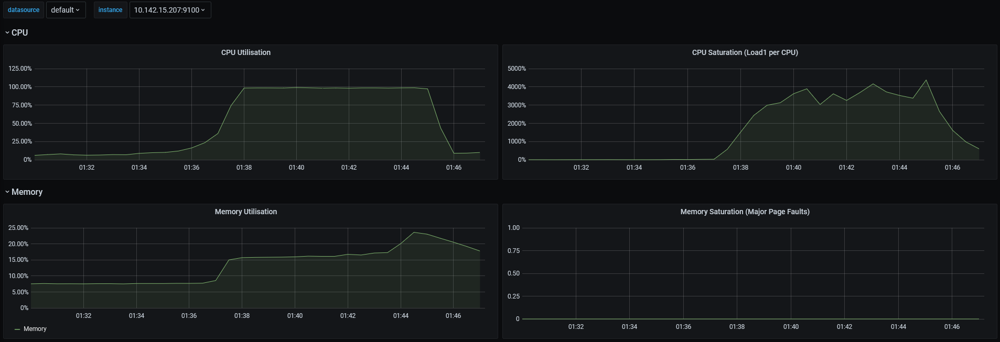

Furthermore, a few network packets were dropped by the dispatcher at rates that were already exceeding the CPU capacity.

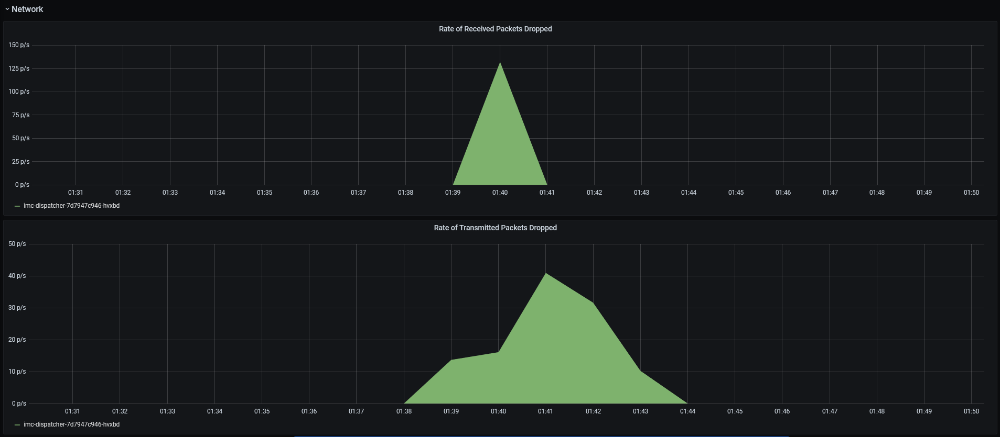

Probably due to bursts similar to the ones observed in the receiver's throughput graph, we can also observe packet drops
on the receiver's end.

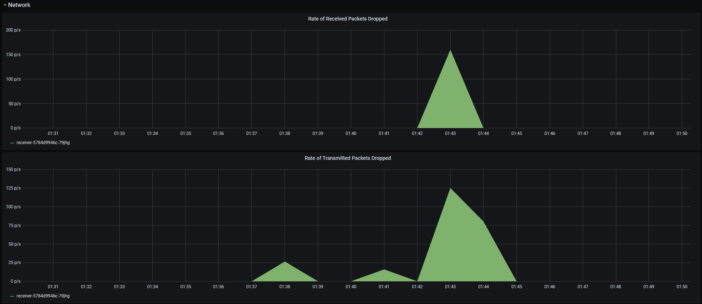

#### Sustained

An attackers is started for a duration of 10 to 15 min. Payloads are CloudEvents generated by [`cegen`][cegen] with a
fixed data of 2 KiB, and piped to `vegeta` at rates ranging from 1,000 events/sec to 4,000 events/sec:

```console
$ cegen -u http://default-kne-trigger-kn-channel.antoineco.svc.cluster.local -d @/sample-ce-data.json \
  | vegeta attack -lazy -format=json -duration=10m -rate=2000/s \
  | vegeta report
```

The results of the ramping test above are invalidated during sustained load tests. We noticed that, above a rate of
**2,000 events/sec**, the dispatcher eventually and suddenly starts consuming the entire CPU time, at which point the
memory usage increases quickly until the process gets OOM-killed. Those crashes are identified by vertical dashed
markers in both panels of the _Compute resources_ row.

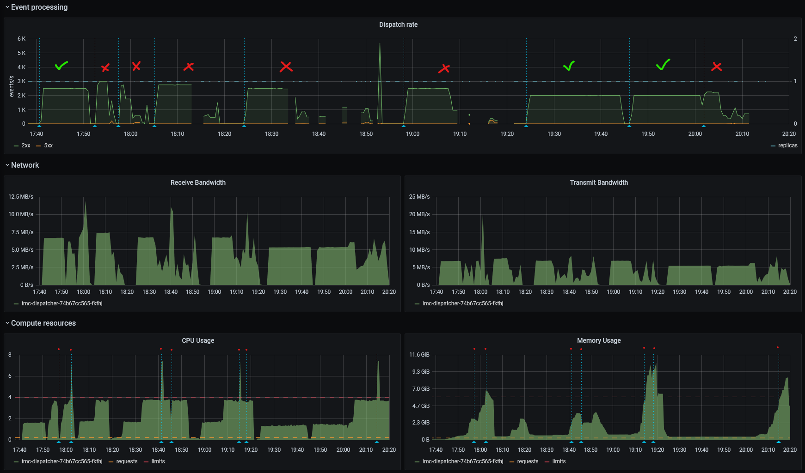

Even at our previously determined high limit of 5,000 events/sec, results vary a lot for attacks longer than 5s (they
tend to remain slightly more stable below 5s), as shown in the following Vegeta reports of 4 consecutive attacks during
8s:

```console
$ cegen -u http://default-kne-trigger-kn-channel.antoineco.svc.cluster.local -d @/sample-ce-data.json \
  | vegeta attack -lazy -format=json -duration=8s -rate=5000/s \
  | vegeta report
```

```
Requests      [total, rate, throughput]         40000, 5000.10, 4997.88
Duration      [total, attack, wait]             8.003s, 8s, 3.552ms
Latencies     [min, mean, 50, 90, 95, 99, max]  274.618µs, 38.84ms, 562.512µs, 161.037ms, 292.61ms, 427.116ms, 678.386ms
Bytes In      [total, mean]                     0, 0.00
Bytes Out     [total, mean]                     81920000, 2048.00
Success       [ratio]                           100.00%
Status Codes  [code:count]                      202:40000
Error Set:
```

```
Requests      [total, rate, throughput]         28296, 3956.25, 794.36
Duration      [total, attack, wait]             35.574s, 7.152s, 28.421s
Latencies     [min, mean, 50, 90, 95, 99, max]  262.345µs, 4.414s, 5.273s, 9.402s, 9.881s, 10.015s, 31.301s
Bytes In      [total, mean]                     0, 0.00
Bytes Out     [total, mean]                     57872384, 2045.25
Success       [ratio]                           99.87%
Status Codes  [code:count]                      0:38  202:28258
Error Set:
Post "http://default-kne-trigger-kn-channel.antoineco.svc.cluster.local": context deadline exceeded (Client.Timeout exceeded while awaiting headers)
```

```
Requests      [total, rate, throughput]         40000, 5000.10, 4999.40
Duration      [total, attack, wait]             8.001s, 8s, 1.118ms
Latencies     [min, mean, 50, 90, 95, 99, max]  269.23µs, 46.155ms, 780.771µs, 173.067ms, 287.934ms, 507.089ms,
954.231ms
Bytes In      [total, mean]                     0, 0.00
Bytes Out     [total, mean]                     81920000, 2048.00
Success       [ratio]                           100.00%
Status Codes  [code:count]                      202:40000
Error Set:
```

```
Requests      [total, rate, throughput]         34437, 4281.62, 742.16
Duration      [total, attack, wait]             45.448s, 8.043s, 37.405s
Latencies     [min, mean, 50, 90, 95, 99, max]  293.997µs, 8.103s, 10.89s, 13.92s, 14.179s, 15.766s, 37.936s
Bytes In      [total, mean]                     0, 0.00
Bytes Out     [total, mean]                     69079040, 2005.95
Success       [ratio]                           97.95%
Status Codes  [code:count]                      0:707  202:33730
Error Set:
Post "http://default-kne-trigger-kn-channel.antoineco.svc.cluster.local": dial tcp 0.0.0.0:0->10.19.253.198:80: bind: address already in use
Post "http://default-kne-trigger-kn-channel.antoineco.svc.cluster.local": read tcp 10.16.15.2:49088->10.19.253.198:80: read: connection reset by peer
```

### Multiple instances

In this test, we scaled the IMC dispatcher Deployment to **5** replicas.

:warning: It is necessary to set the `--disable-ha` command-line argument in dispatchers' container definitions when
scaling to more than 1 replica due to [knative/eventing#4638][kne-issue4638].

All 3 attackers were started simultaneously for a duration of 15 min. Payloads are CloudEvents generated by
[`cegen`][cegen] with a fixed data of 2 KiB, and piped to `vegeta` at rates ranging from 3,000 events/sec to 6,000
events/sec:

```console
$ cegen -u http://default-kne-trigger-kn-channel.antoineco.svc.cluster.local -d @/sample-ce-data.json \
  | vegeta attack -lazy -format=json -duration=15m -rate=3000/s \
  | vegeta report
```

A combined request rate of about **15,000 events/sec** is ingested without difficulties, which is 50% more than the
determined limit of 2000 events/sec for a single instance multiplied by the number of dispatchers (5). Above that rate,
dispatchers heavily starve on CPU time once again.

_Note: The gaps in the graph are not due to Pods crashing but to Prometheus failing to scrape metrics from overwhelmed
dispatchers._

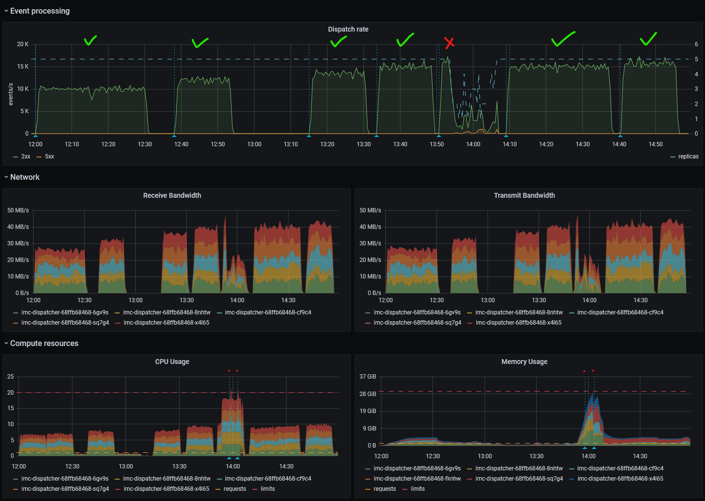

Sample Vegeta report at 5,000 events/sec (per attacker):

```
Requests      [total, rate, throughput]         4500000, 5000.00, 4999.99
Duration      [total, attack, wait]             15m0s, 15m0s, 2.933ms
Latencies     [min, mean, 50, 90, 95, 99, max]  251.869µs, 682.553µs, 471.372µs, 937.298µs, 1.607ms, 4.217ms, 189.443ms
Bytes In      [total, mean]                     0, 0.00
Bytes Out     [total, mean]                     9216000000, 2048.00
Success       [ratio]                           100.00%
Status Codes  [code:count]                      202:4500000
Error Set:
```

Sample Vegeta report at 5,250 events/sec (per attacker):

```
Requests      [total, rate, throughput]         4725005, 5250.01, 5250.00
Duration      [total, attack, wait]             15m0s, 15m0s, 471.198µs
Latencies     [min, mean, 50, 90, 95, 99, max]  239.211µs, 762.428µs, 498.002µs, 1.125ms, 1.76ms, 4.965ms, 399.287ms
Bytes In      [total, mean]                     0, 0.00
Bytes Out     [total, mean]                     9676810240, 2048.00
Success       [ratio]                           100.00%
Status Codes  [code:count]                      202:4725005
Error Set:
```

Sample Vegeta report at 5,500 events/sec (per attacker), interrupted manually 1 min before the end due to dispatchers
crashing:

```
Requests      [total, rate, throughput]         2417734, 2943.07, 2748.22
Duration      [total, attack, wait]             13m44s, 13m42s, 2.14s
Latencies     [min, mean, 50, 90, 95, 99, max]  226.721µs, 1m43s, 13.806s, 5m20s, 5m57s, 6m26s, 9m58s
Bytes In      [total, mean]                     0, 0.00
Bytes Out     [total, mean]                     4639569920, 1918.97
Success       [ratio]                           93.62%
Status Codes  [code:count]                      0:152319  202:2263550  500:1865
Error Set:
Post "http://default-kne-trigger-kn-channel.antoineco.svc.cluster.local": http: server closed idle connection
Post "http://default-kne-trigger-kn-channel.antoineco.svc.cluster.local": dial tcp 0.0.0.0:0->10.19.253.198:80: bind: address already in use
Post "http://default-kne-trigger-kn-channel.antoineco.svc.cluster.local": context deadline exceeded (Client.Timeout exceeded while awaiting headers)
Post "http://default-kne-trigger-kn-channel.antoineco.svc.cluster.local": read tcp 10.16.19.2:32895->10.19.253.198:80: read: connection reset by peer
Post "http://default-kne-trigger-kn-channel.antoineco.svc.cluster.local": read tcp 10.16.19.2:41817->10.19.253.198:80: read: connection reset by peer
Post "http://default-kne-trigger-kn-channel.antoineco.svc.cluster.local": read tcp 10.16.19.2:39973->10.19.253.198:80: read: connection reset by peer
Post "http://default-kne-trigger-kn-channel.antoineco.svc.cluster.local": read tcp 10.16.19.2:59385->10.19.253.198:80: read: connection reset by peer
Post "http://default-kne-trigger-kn-channel.antoineco.svc.cluster.local": read tcp 10.16.19.2:53637->10.19.253.198:80: read: connection reset by peer
Post "http://default-kne-trigger-kn-channel.antoineco.svc.cluster.local": read tcp 10.16.19.2:39079->10.19.253.198:80: read: connection reset by peer
Post "http://default-kne-trigger-kn-channel.antoineco.svc.cluster.local": read tcp 10.16.19.2:56925->10.19.253.198:80: read: connection reset by peer
```

## Broker with channel

The channel was then tested behind the broker's components (ingress and filter). The number of channel dispatchers was
pinned to 5\. A Trigger object was used to deliver events to the receiver.

_tl;dr;_ Given the conditions of the TriggerMesh production where any Knative Eventing component may be sharing compute
resources with another Eventing component (e.g. broker ingress and channel dispatcher on the same node), the
multi-tenant broker can ingest up to **12,000 events/sec**. At this rate, the p90 end-to-end latency is around
**400ms**.

```yaml
# Subscribe to "io.triggermesh.perf.drill" events from "default" broker, deliver them to receiver/thrpt-receiver.
apiVersion: eventing.knative.dev/v1
kind: Trigger
metadata:
  name: perf
  namespace: antoineco
spec:
  broker: default
  filter:
    attributes:
      type: io.triggermesh.perf.drill
  subscriber:
    uri: http://receiver-internal.perf-receiver.svc.cluster.local/
```

### Throughput

All 3 attackers were started simultaneously for a duration of 15 min. Payloads are CloudEvents generated by
[`cegen`][cegen] with a fixed data of 2 KiB, and piped to `vegeta` at rates ranging from 3,000 events/sec to 5,000
events/sec:

```console
$ cegen -u http://broker-ingress.knative-eventing.svc.cluster.local/antoineco/default -d @/sample-ce-data.json \
  | vegeta attack -lazy -format=json -duration=1m -rate=3000/s \
  | vegeta report
```

The maximum measured request rate over the broker is about **12,000 events/sec**, which is less than what the channel
alone can ingest. This can be explained by the fact that 3 Eventing components are active during the lifetime of a
request (ingress, dispatcher, filter) and, because the configured Pod anti-affinity only affects Pods within a given
Deployment, those components are sometimes collocated with another Eventing component.

_Note: Due to a [bug affecting both the ingress and filter][kne-issue4645], application-level metrics such as the event
throughput for those components are unavailable in the graphs below._

Both the ingresses' and filters' resource usage remains rather stable for the entire duration of the test.

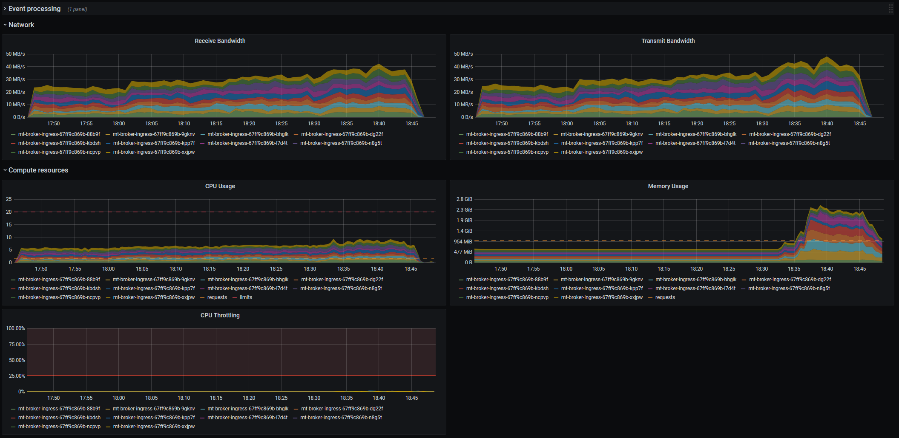
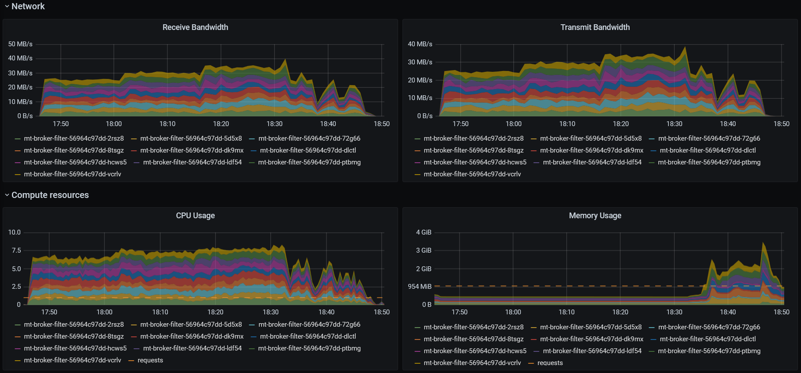

The dispatcher exhibits the same pattern as during the channel load test: its CPU and memory usage increase suddenly
after a certain threshold, until the process gets OOM-killed.

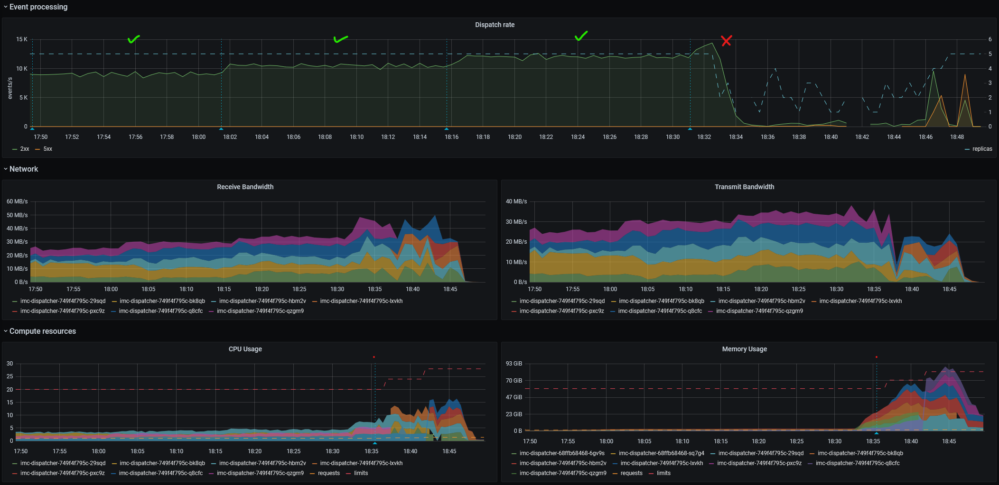

The resources distribution and CPU saturation can also be seen by looking at the nodes' metrics:

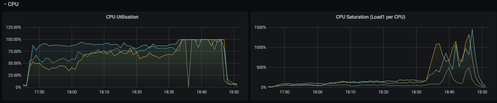
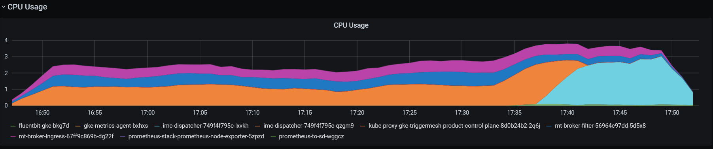
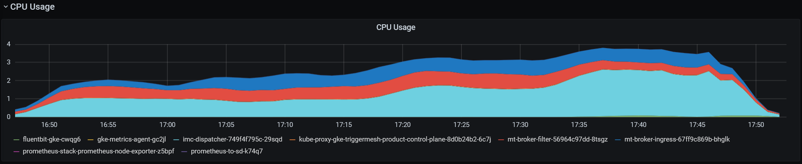

Sample Vegeta report at 4,000 events/sec (per attacker):

```
Requests      [total, rate, throughput]         3600000, 4000.00, 3999.99
Duration      [total, attack, wait]             15m0s, 15m0s, 2.994ms
Latencies     [min, mean, 50, 90, 95, 99, max]  551.38µs, 1.532ms, 1.153ms, 2.457ms, 3.656ms, 6.66ms, 96.542ms
Bytes In      [total, mean]                     0, 0.00
Bytes Out     [total, mean]                     7372800000, 2048.00
Success       [ratio]                           100.00%
Status Codes  [code:count]                      202:3600000
Error Set:
```

### End-to-end latency

We used Knative Eventing's [performance testing suite][kne-perf-test] to determine the end-to-end latency of events
under load. This latency is measured by substracting the time an event was sent by Vegeta to the time it was received by
the event receiver (by comparing event IDs).

Latency and thoughput graphs were generated using the gnuplot script from [`thrpt-receiver`][thrpt-receiver-profile].

Below is a global overview of the dispatchers during both load tests.

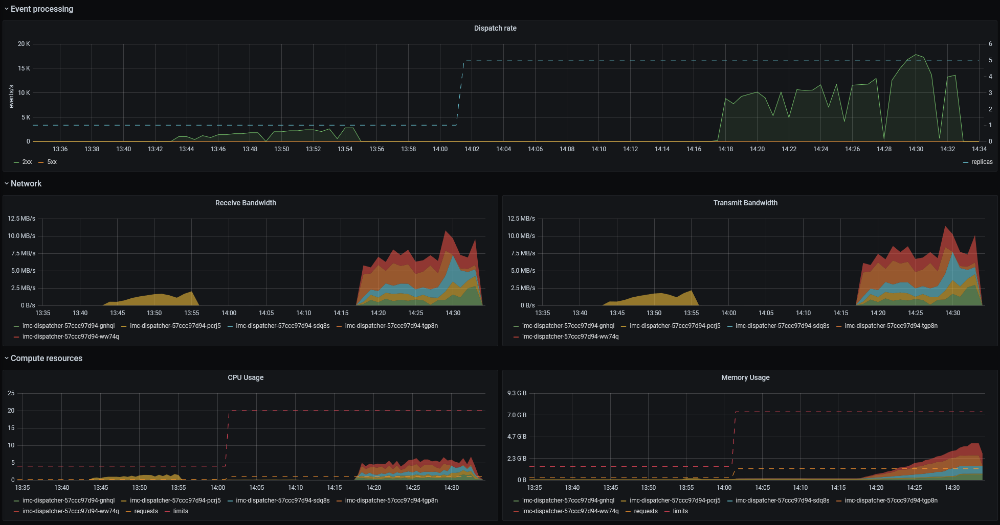

#### Single dispatcher

The load was ramped from 1,000 events/sec to 2,800 events/sec by increments of 200 every minute. The following `pace`
argument was passed to the event sender:

```
--pace=1000:60,1200:60,1400:60,1600:60,1800:60,2000:60,2200:60,2400:60,2600:60,2800:60
```

At 2,800 events/s, the 90th percentile seems to be roughly **between 300ms and 400ms**.

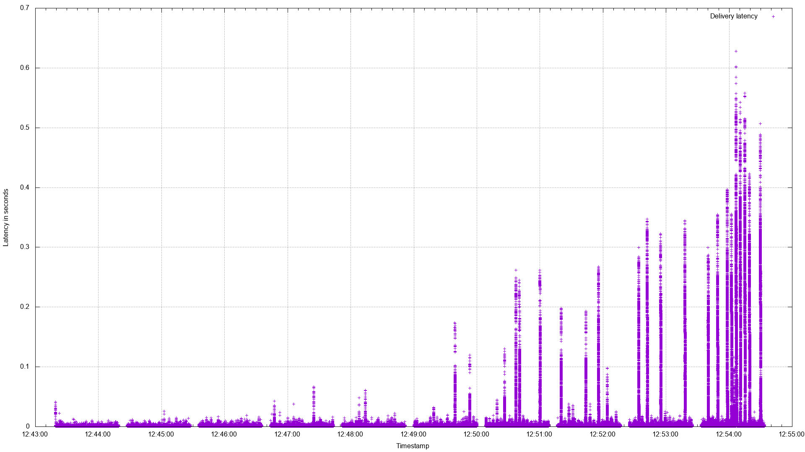
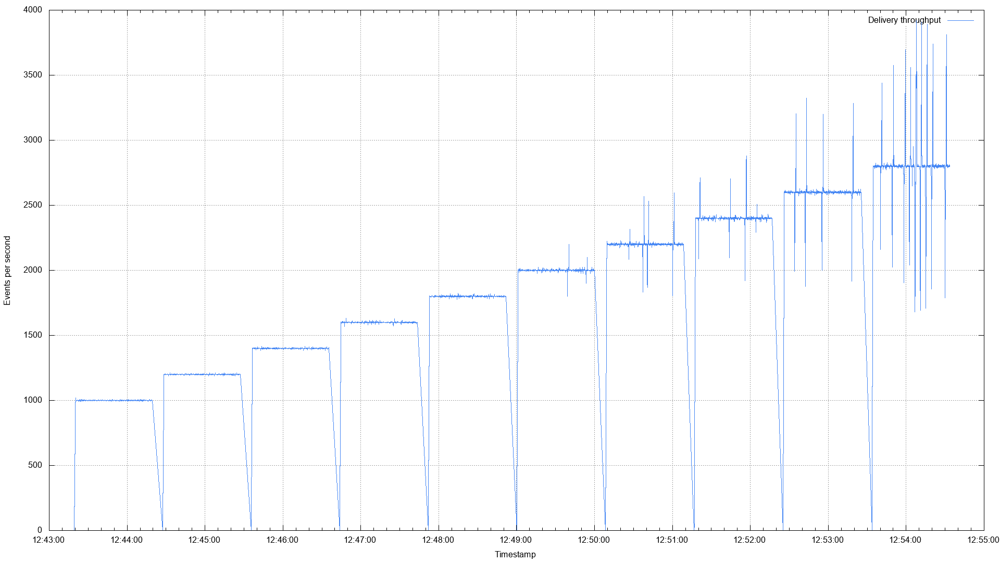

#### Multiple dispatchers

The load was ramped from 9,000 events/sec to 13,800 events/sec by increments of 400 every minute. The following `pace`
argument was passed to the event sender:

```
--pace=9000:60,9400:60,9800:60,10200:60,10600:60,11000:60,11400:60,11800:60,12200:60,12600:60,13000:60,13400:60,13800:60
```

At 13,800 events/s, the 90th percentile seems to be roughly around **400ms**.

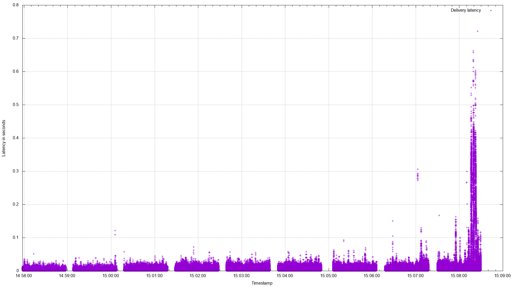
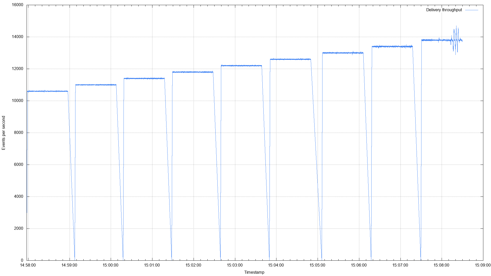

[gce-machines]: https://cloud.google.com/compute/docs/machine-types
[receiver]: ../../receiver/
[thrpt-receiver]: ../../thrpt-receiver
[thrpt-receiver-profile]: ../../thrpt-receiver#throughput
[cegen]: ../../tools/cegen/
[kne-perf-test]: https://github.com/knative/eventing/tree/master/test/performance
[kne-issue4638]: https://github.com/knative/eventing/issues/4638
[kne-issue4645]: https://github.com/knative/eventing/issues/4645
