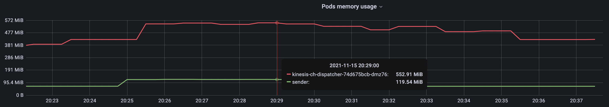

### Conditions

| Component        | Version            |
| ---------------- | ------------------ |
| Platform         | `eks.3`            |
| Kubernetes       | `v1.21`            |
| Knative Eventing | `v1.0.0`           |

Test platform:

* 1 `vegeta` sender
* 1 [aws-kinesis-channel](https://github.com/triggermesh/aws-kinesis-channel) dispatcher
* 1 [Amazon Kinesis](https://aws.amazon.com/kinesis/) data stream with 1-3 shards
* 1 [thrpt-receiver](perf/thrpt-receiver) 

All pods involved in tests were running on dedicated EC2 [t3-xlarge](https://aws.amazon.com/ec2/instance-types/t3/) nodes with 3500m CPU and 14GB RAM available for user workloads.

Assumptions based on previous load tests:

* A single instance of sender and receiver are able to sustain the load of 12,000+ events per second which is far above expected channel performance and Kinesis shard [limits](https://docs.aws.amazon.com/streams/latest/dev/service-sizes-and-limits.html). Thus, one sender and receiver were enough to create a sufficient data test stream.

---

## Results

### Events ingestion performance

Before running complete lifecycle tests it may be useful to get the numbers for receiver part of the channel dispatcher to isolate possible bottlenecks. 

The Kinesis stream supports up to 1000 events/sec (or 1MB/sec) per shard. Test channel is backed by the stream that has 3 shards which should give overall throughput of 3000 events/sec or 3MB/sec. To check these numbers we used the [cegen](../../tools/cegen/) tool to generate CloudEvents with a fixed size of 1KiB, piped to `vegeta` attacker configured to send these events to test channel.

5 minutes, 1KiB payload, 3000 events/sec, no subscribers:

```console
cegen -u http://kinesis-ch-dispatcher.perf-thrpt-receiver.svc.cluster.local -d @sample-ce-data.json | vegeta attack -lazy -format json -duration 5m -rate 3000/s | vegeta report

Requests      [total, rate, throughput]  899999, 3000.00, 2999.34
Duration      [total, attack, wait]      5m0.066040886s, 4m59.99926075s, 66.780136ms
Latencies     [mean, 50, 95, 99, max]    55.100867ms, 47.494403ms, 118.637416ms, 169.2362ms, 966.058367ms
Bytes In      [total, mean]              0, 0.00
Bytes Out     [total, mean]              921598976, 1024.00
Success       [ratio]                    100.00%
Status Codes  [code:count]               202:899999
```

As we can see in the Vegeta report, the channel dispatcher managed to successfully ingest all events with acceptable latency.


From the resources usage graphs, we can conclude that the message ingestion is a CPU-intensive operation as the channel dispatcher pod consumed almost all 4 cores of the node it was running on.

To confirm our observations additional tests with different input data were executed. For example, the graph below shows the ingestion performance for events size of 2KiB:


_1500 events/sec * 2KiB/event = 3MB/sec_

### Sustained load

For sustained loading tests, we used the same tooling and JSON sample to generate the load, but this time events were retrieved from the Kinesis stream and sent to the [thrpt-receiver](../../thrpt-receiver#throughput).

5 minutes, 1KiB payload, 3000 events/sec:

```console
Requests      [total, rate, throughput]  900000, 3000.01, 2999.65
Duration      [total, attack, wait]      5m0.03457887s, 4m59.998884678s, 35.694192ms
Latencies     [mean, 50, 95, 99, max]    47.444922ms, 39.374407ms, 105.95713ms, 139.964033ms, 1.142545852s
Bytes In      [total, mean]              0, 0.00
Bytes Out     [total, mean]              921600000, 1024.00
Success       [ratio]                    100.00%
Status Codes  [code:count]               202:900000
```

Vegeta attack finished without errors or delays.


The receiver result chart showed the picture that could be interpreted as a lack of shared resources because the time of the significant increase in events rate matches exactly the time of the end of the Vegeta attack.





As stated earlier, and confirmed by the graphs above, events ingestion is a CPU-intensive process that could easily occupy the whole processor of a dedicated node. And since events ingestion and forwarding are running in parallel threads it is possible that they are reaching CPU limits.

Doubling available CPU resource of the node straightened the receiver report graph and reduced receiving time from 10 minutes to approximately 7 minutes for 5 minutes Vegeta attack. 


_The new dedicated node has 8 cores allocatable for user workloads_

Periodic drops in events receive rate on the receiver graph above may be the sign of suboptimal configuration of AWS Kinesis SDK [GetRecords](https://github.com/aws/aws-sdk-go/blob/v1.42.4/service/kinesis/api.go#L1328) function, the return [Limit](https://github.com/aws/aws-sdk-go/blob/v1.42.4/service/kinesis/api.go#L1247-L1255) parameter in particular.

For the channels that are expecting to receive long-running, high event rate loads it is recommended to create the Kinesis streams with the throughput that exceeds the expected load with a margin.
