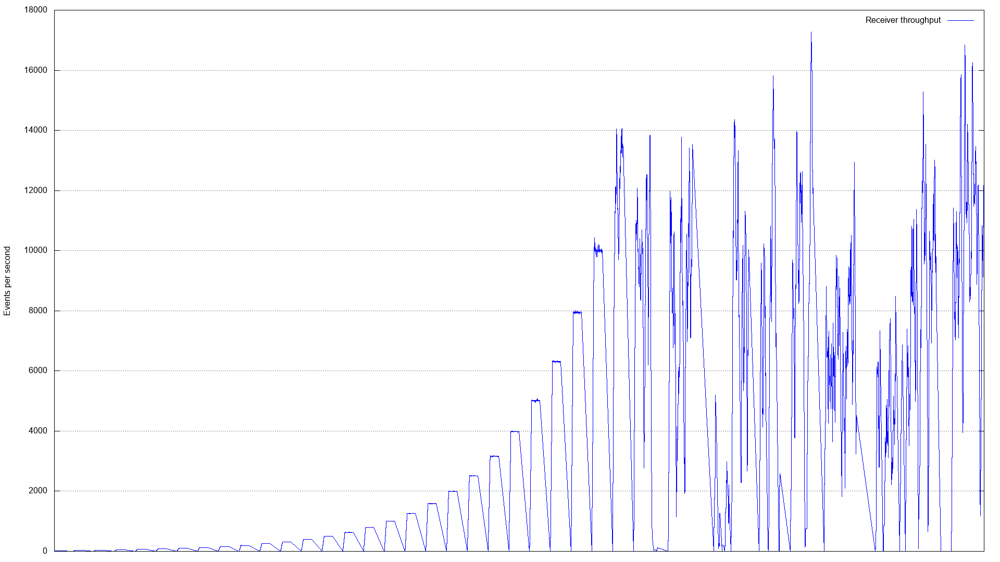

# thrpt-receiver

A simple CloudEvent receiver that can measure the throughput of the events it receives and send results to a [Mako stub
sidecar][mako-stub].

```none
Usage of thrpt-receiver:
  -consecutive-quiet-periods uint
        Consecutive recheck-period after which data is aggregated if no new event has been recorded. (default 2)
  -estimated-total-events uint
        Estimated total number of events to receive. Used to pre-allocate memory. (default 100)
  -profiling
        Periodically publish the length of the receive queue to Mako and enable a pprof server on port 8008.
  -recheck-period duration
        Frequency at which the recording of new events is being checked. (default 5s)
```

---

## Contents

1. [Running the receiver in a cluster](#running-the-receiver-in-a-cluster)
   * [Deployment](#deployment)
   * [Sending events](#sending-events)
   * [Reading results](#reading-results)
   * [Clean up](#clean-up)
1. [Plotting](#plotting)
1. [Profiling](#profiling)
   * [Throughput](#throughput)
   * [Latency](#latency)

## Running the receiver in a cluster

### Deployment

Deploy the receiver and its dependencies into the `perf-thrpt-receiver` namespace using `ko`:

```console
$ ko apply -f config/
```

The receiver will be waiting for the first event to be received:

```console
$ kubectl -n perf-thrpt-receiver logs thrpt-receiver receiver
2020/10/30 16:17:03 Running event recorder
2020/10/30 16:17:03 Running CloudEvents handler
2020/10/30 16:17:03 Waiting for the first event to be received
```

### Sending events

Configure an event source to send events to the `perf-thrpt-receiver/thrpt-receiver` Service, for example using a sink
reference:

```yaml
sink:
  ref:
    apiVersion: v1
    kind: Service
    name: thrpt-receiver
    namespace: perf-thrpt-receiver
```

After the first event has been received, the receiver keeps processing events and checks every `-recheck-period` that
events are still being received. If no event is received for a number of periods corresponding to
`-consecutive-quiet-periods`, the receiver stops its event handler and publishes the benchmark's results to its Mako
sidecar:

```console
$ kubectl -n perf-thrpt-receiver logs thrpt-receiver receiver
...
2020/10/30 16:28:05 Event received, waiting until no more event is being recorded for 2 consecutive periods of 5s
2020/10/30 16:30:30 Observed 1 period(s) without event
2020/10/30 16:30:35 Observed 2 period(s) without event
2020/10/30 16:30:35 Stopping event recorder and CloudEvents handler
2020/10/30 16:30:35 Received events count: 1000
2020/10/30 16:30:35 Processing data
2020/10/30 16:30:35 Publishing results to Mako
```

### Reading results

The results, presented in a CSV format, can be exported from a HTTP endpoint served by the Mako sidecar on port `8081`.

Forward the local TCP port `8081` to the `thrpt-receiver` Pod:

```console
$ kubectl -n perf-thrpt-receiver port-forward thrpt-receiver 8081
Forwarding from 127.0.0.1:8081 -> 8081
```

Retrieve the results over HTTP at the `/results` endpoint and write the output to a file named `results.csv`:

```console
$ curl http://localhost:8081/results -o results.csv
  % Total    % Received % Xferd  Average Speed   Time    Time     Time  Current
                                 Dload  Upload   Total   Spent    Left  Speed
100 6771k    0 6771k    0     0  5976k      0 --:--:--  0:00:01 --:--:-- 5976k
```

The contents of the `results.csv` file should be similar to the example below:

```csv
# Received input
# Input completed
# Benchmark  - Event throughput
# {"benchmarkKey":"","tags":["nodes=6","project-id=cebuk-01","zone=us-central1-a","commit=f584d79","kubernetes=v1.17.12-gke.500","goversion=go1.15.2"]}
# inputValue,errorMessage,rt
...
1.605030612296653e+12,,746
1.605030612298227e+12,,747
1.6050306122983225e+12,,748
1.6050306122986868e+12,,749
1.6050306122990955e+12,,750
1.605030612299801e+12,,751
1.605030612300778e+12,,752
1.60503061230106e+12,,753
...
# CSV end
```

See the [Plotting](#plotting) section below for suggestions about exploiting those results.

Send a final HTTP request to the `/close` endpoint to allow the Mako sidecar to terminate:

```console
$ curl -s http://localhost:8081/close
```

### Clean up

By default, the receiver Pod is requesting the resources of an entire cluster node, which makes it expensive to run. It
is therefore a good practice to clean up the receiver's resources at the end of the benchmark:

```console
$ ko delete -f config/
```

## Plotting

The results published by `thrpt-receiver` can be visualized by generating plots from CSV data. A few different ways to
create such visualizations are described in this section.

### Google Sheets

1. Open a Sheet, then select **File > Import > Upload** to upload the CSV file generated from the logs of the Mako
   sidecar.

   

1. _(optional)_ Delete the unnecessary comment rows 1-3 and B column (`errorMessage`) by highlighting them, then
   selecting **Edit > Delete rows/column ...**.

1. _(optional)_ Create a column containing human-friendly timestamps.

   Highlight the A column (`inputValue`), then select **Insert > Column right**. Select the B2 cell, and use the
   following [formula][gsheets-ts-formula] in the formula bar: `=A2/1000/60/60/24 + DATE(1970,1,1)`.

   Format the cell as a Time by selecting **Format > Number > Time**, then apply that format and formula to the entire
   column, either with `Ctrl-C` (highlight all cells with `Ctrl-Shift-↓`) `Ctrl-V`, or by using the [Fill
   Handle][gsheets-fill].

   

1. Highlight the entire time:value data range, then select **Insert > Chart**.

1. Edit the chart's options and select the _Line chart_ type. You may also need to manually set the `time` column as the
   X-axis.

   

1. You can improve the visualization of the chart by moving it to its own sheet. This can be achieved by selecting
   **Move to own sheet** in the menu accessible in the top-right corner of the chart.

   

## Profiling

The figures presented in this section describe the profile of a single instance of `thrpt-receiver` running under heavy
load on a dedicated node in the TriggerMesh production cluster ([GCE n1-standard-2][gce-machines]). Those metrics can be
used as a baseline to assess the performance of other CloudEvent handlers.

We ensured that the limits of the `thrpt-receiver` process, in particular the maximum number of open files, were high
enough to sustain a high number of concurrent connections. The number of outgoing connections established by a single
load generator can not exceed the number of ports available on its host (65536), so we consider any value above that
number as acceptable for the `nofile` resource limit of the receiver:

```
/ # cat /proc/3352/limits
Limit                     Soft Limit           Hard Limit           Units
...
Max processes             unlimited            unlimited            processes
Max open files            1048576              1048576              files
...
```

### Throughput

_The Go garbage collector was disabled for the entire duration of this load test to prevent GC pauses from influencing
the results. The event store was initialized with a size of 300,000 using the `-estimated-total-events` flag._

The attack was performed in 5 intervals of 12s, by increments of 1600 events/sec, with a payload of 2 KiB. Below is a
summary of the attack as reported by [`vegeta`][vegeta].

```
Requests      [total, rate, throughput]         275124, 4543.47, 4539.96
Duration      [total, attack, wait]             1m1s, 1m1s, 46.915ms
Latencies     [min, mean, 50, 90, 95, 99, max]  250.013µs, 152.998ms, 1.134ms, 555.641ms, 911.698ms, 1.36s, 2.412s
Bytes In      [total, mean]                     0, 0.00
Bytes Out     [total, mean]                     563453952, 2048.00
Success       [ratio]                           100.00%
Status Codes  [code:count]                      200:275124
Error Set:
```

The throughput data collected by the Mako sidecar was extracted as a CSV file and displayed in a chart generated using
Google Sheets. Although vegeta reported a success rate of 100%, we can observe that the thoughput becomes extremely
unstable between the 4th and 5th intervals, roughly between 6400 and 8000 events/sec.



During the load test, `thrpt-receiver` was running with the `-profiling` flag so we could extract an execution trace
from the pprof server and analyze the heap profile of the application:

```console
$ kubectl -n perf-thrpt-receiver port-forward thrpt-receiver 8008
Forwarding from 127.0.0.1:8008 -> 8008
```

```console
$ curl 'http://localhost:8008/debug/pprof/trace?seconds=75' > trace.out
(collects an execution trace for 75s, then returns)
```

```console
$ go tool trace trace.out
2020/11/10 21:39:10 Parsing trace...
2020/11/10 21:39:18 Splitting trace...
2020/11/10 21:39:32 Opening browser. Trace viewer is listening on http://127.0.0.1:33877
```

In a web browser, we observed an initial heap size of 4.4 MiB. After the 275124 events had been received, 3.5 GiB were
allocated to the heap. This number went down to 125.7 MiB after the forced garbage collection triggered by
`thrpt-receiver`.


### Latency

_Because a lot more events were generated in the latency test than in the thoughput test (969775 vs. 275124), we ensured
the Go garbage collector was enabled to prevent the Pod performing the attack from being OOM killed._

Using the [ramp-requests.py](../load-ramping/) script, a succession of 5s attacks were performed at different rates,
ranging from 1 event/sec to 79,432 events/sec (theoretical), with a payload of 2 KiB.

In the graph below, we can observe that all requests succeeded, even in the higher ranges. However, most requests
(median) above the 8,000 events/sec mark had to wait for more than 1s to get a response from the receiver.


Vegeta reports indicate that the receiver starts showing severe signs of weakness (wait times >1sec) somewhere between
8,000 events/sec and 10,000 events/sec:

```
Requests      [total, rate, throughput]         39693, 7912.43, 7071.79
Duration      [total, attack, wait]             5.613s, 5.017s, 596.331ms
Latencies     [min, mean, 50, 90, 95, 99, max]  417.864µs, 489.299ms, 593.072ms, 735.633ms, 759.615ms, 800.473ms, 1.397s
Bytes In      [total, mean]                     0, 0.00
Bytes Out     [total, mean]                     81291264, 2048.00
Success       [ratio]                           100.00%
Status Codes  [code:count]                      200:39693
Error Set:
```

```
Requests      [total, rate, throughput]         49992, 9989.12, 6506.87
Duration      [total, attack, wait]             7.683s, 5.005s, 2.678s
Latencies     [min, mean, 50, 90, 95, 99, max]  598.176µs, 1.481s, 1.496s, 2.594s, 2.648s, 2.724s, 4.554s
Bytes In      [total, mean]                     0, 0.00
Bytes Out     [total, mean]                     102383616, 2048.00
Success       [ratio]                           100.00%
Status Codes  [code:count]                      200:49992
Error Set:
```

On the receiver, the measured throughput never exceeded ~7,000 events/sec, as shown in the graph below which is a
zoomed-in view of the last ~5s of the attack (at a _theoretical_ rate of 79,432 events/sec).


In reality, the Vegeta reports of the last few attacks show that the attacker itself isn't able to produce more than
~20,000 events/sec on that hardware.

For a target of 25,118 events/sec:

```
Requests      [total, rate, throughput]         101381, 20190.99, 6198.92
Duration      [total, attack, wait]             16.355s, 5.021s, 11.334s
Latencies     [min, mean, 50, 90, 95, 99, max]  642.621µs, 6.24s, 6.367s, 10.373s, 10.932s, 11.315s, 15.002s
Bytes In      [total, mean]                     0, 0.00
Bytes Out     [total, mean]                     207628288, 2048.00
Success       [ratio]                           100.00%
Status Codes  [code:count]                      200:101381
Error Set:
```

For a target of 39,810 events/sec:

```
Requests      [total, rate, throughput]         103667, 20002.61, 6156.27
Duration      [total, attack, wait]             16.839s, 5.183s, 11.657s
Latencies     [min, mean, 50, 90, 95, 99, max]  3.121ms, 6.417s, 6.802s, 10.811s, 11.343s, 11.81s, 15.527s
Bytes In      [total, mean]                     0, 0.00
Bytes Out     [total, mean]                     212310016, 2048.00
Success       [ratio]                           100.00%
Status Codes  [code:count]                      200:103667
Error Set:
```

For a target of 50,118 events/sec:

```
Requests      [total, rate, throughput]         109669, 21870.86, 6144.78
Duration      [total, attack, wait]             17.848s, 5.014s, 12.833s
Latencies     [min, mean, 50, 90, 95, 99, max]  390.626µs, 7.392s, 7.892s, 12.029s, 12.302s, 12.779s, 16.851s
Bytes In      [total, mean]                     0, 0.00
Bytes Out     [total, mean]                     224602112, 2048.00
Success       [ratio]                           100.00%
Status Codes  [code:count]                      200:109669
Error Set:
```

[mako-stub]: https://github.com/knative/pkg/tree/release-0.18/test/mako
[gsheets-ts-formula]: https://webapps.stackexchange.com/a/112651
[gsheets-fill]: https://support.google.com/docs/answer/75509
[vegeta]: https://github.com/tsenart/vegeta
[gce-machines]: https://cloud.google.com/compute/docs/machine-types
